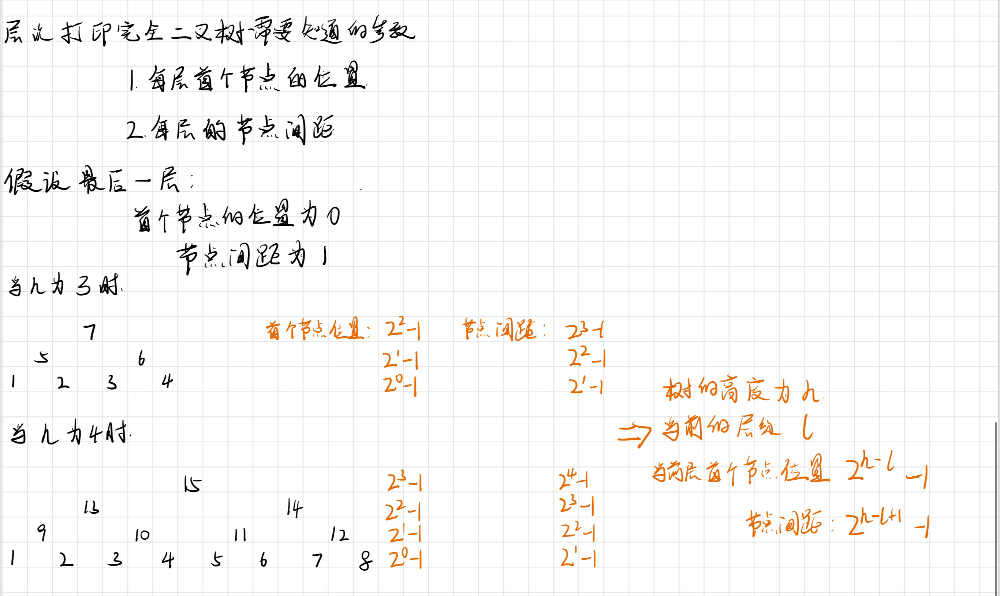
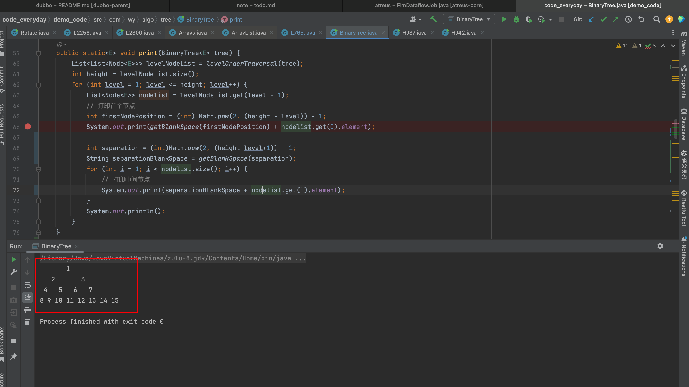
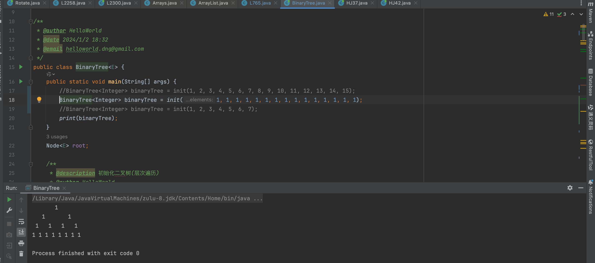
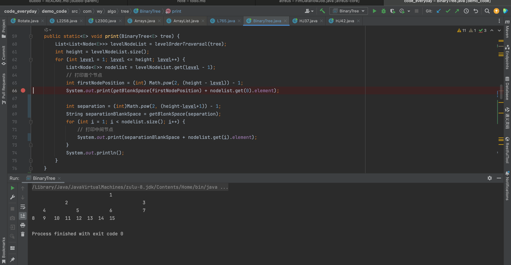
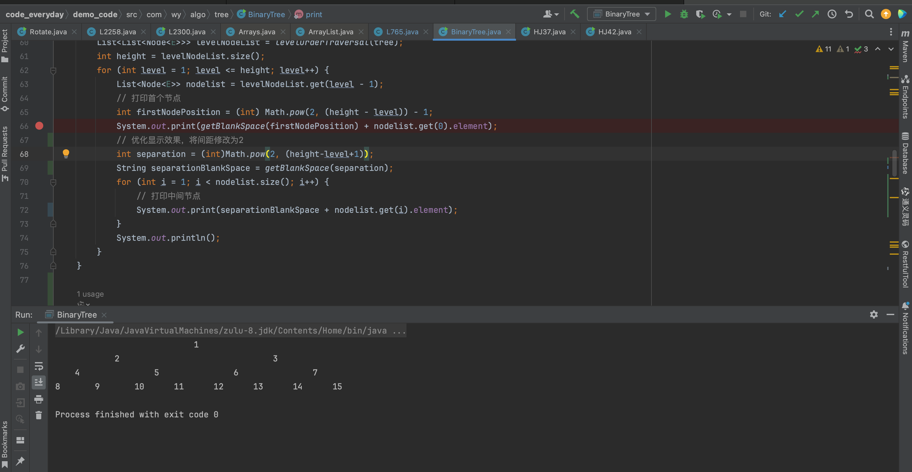

# 按照层次遍历结果打印完全二叉树



按照推论结果：

* l 层首个节点位置  **2^h-l^ - 1**
* l 层节点间距：**2^h-l+1^ - 1**

## 编码实现

```java
 public static<E> void print(BinaryTree<E> tree) {
        List<List<Node<E>>> levelNodeList = levelOrderTraversal(tree);
        int height = levelNodeList.size();
        for (int level = 1; level <= height; level++) {
            List<Node<E>> nodelist = levelNodeList.get(level - 1);
            // 打印首个节点
            int firstNodePosition = (int) Math.pow(2, (height - level)) - 1;
            System.out.print(getBlankSpace(firstNodePosition) + nodelist.get(0).element);

            int separation = (int)Math.pow(2, (height-level+1)) - 1;
            String separationBlankSpace = getBlankSpace(separation);
            for (int i = 1; i < nodelist.size(); i++) {
                // 打印中间节点
                System.out.print(separationBlankSpace + nodelist.get(i).element);
            }
            System.out.println();
        }
    }

    public static<E>List<List<Node<E>>> levelOrderTraversal(BinaryTree<E> tree) {
        Queue<Node<E>> queue = new LinkedList<>();
        queue.offer(tree.root);
        List<List<Node<E>>> result = new ArrayList<>();
        while (!queue.isEmpty()) {
            // 此时队列的容量就是当前层的节点个数
            int levelSize = queue.size();
            ArrayList<Node<E>> levelNodes = new ArrayList<>();
            for (int i = 0; i < levelSize; i++) {
                Node<E> node = queue.poll();
                levelNodes.add(node);

                if (node.left != null) {
                    queue.offer(node.left);
                }

                if (node.right!= null) {
                    queue.offer(node.right);
                }
            }

            result.add(levelNodes);
        }

        return result;
    }

    private static String getBlankSpace(int n) {
        StringBuilder builder = new StringBuilder();
        while (n > 0) {
            builder.append(" ");
            n--;
        }

        return builder.toString();
    }

```

### 打印效果



似乎更预想的不一样，猜测是因为 像 11，12这种两位数实际占了两个字符，导致的。将所有数都改成 1：



显示完美。

### 将空格改为 \t



显示还是有问题。考虑将最后一层间距修改为 2，通过双 \t 控制显示格式




## 完整代码

```java
package com.wy.algo.tree;

import cn.hutool.core.lang.Assert;

import java.util.*;
import java.util.stream.IntStream;
import java.util.stream.Stream;

/**
 * @author HelloWorld
 * @date 2024/1/2 18:32
 * @email helloworld.dng@gmail.com
 */
public class BinaryTree<E> {
    public static void main(String[] args) {
        BinaryTree<Integer> binaryTree = init(1, 2, 3, 4, 5, 6, 7, 8, 9, 10, 11, 12, 13, 14, 15);
        //BinaryTree<Integer> binaryTree = init(1, 1, 1, 1, 1, 1, 1, 1, 1, 1, 1, 1, 1, 1, 1);
        print(binaryTree);
    }
    Node<E> root;

    /**
     * @description 初始化二叉树(层次遍历)
     * @author HelloWorld
     * @create 2024/1/2 18:57
     * @param elements
     * @return com.wy.algo.tree.BinaryTree<E>
     */
    @SafeVarargs
    public static<E> BinaryTree<E> init(E... elements) {
        Assert.notEmpty(elements, "elements must not be empty");
        BinaryTree<E> tree = new BinaryTree<>();
        tree.root = new Node<>(elements[0]);

        Queue<Node<E>> queue = new LinkedList<>();
        queue.offer(tree.root);
        int index = 1;
        while (!queue.isEmpty()) {
            Node<E> node = queue.poll();
            if (index < elements.length) {
                node.left = new Node<>(elements[index]);
                queue.offer(node.left);
            }
            index++;

            if (index < elements.length) {
                node.right = new Node<>(elements[index]);
                queue.offer(node.right);
            }
            index++;
        }

        return tree;
    }


    public static<E> void print(BinaryTree<E> tree) {
        List<List<Node<E>>> levelNodeList = levelOrderTraversal(tree);
        int height = levelNodeList.size();
        for (int level = 1; level <= height; level++) {
            List<Node<E>> nodelist = levelNodeList.get(level - 1);
            // 打印首个节点
            int firstNodePosition = (int) Math.pow(2, (height - level)) - 1;
            System.out.print(getBlankSpace(firstNodePosition) + nodelist.get(0).element);
            // 优化显示效果，将间距修改为2
            int separation = (int)Math.pow(2, (height-level+1));
            String separationBlankSpace = getBlankSpace(separation);
            for (int i = 1; i < nodelist.size(); i++) {
                // 打印中间节点
                System.out.print(separationBlankSpace + nodelist.get(i).element);
            }
            System.out.println();
        }
    }

    public static<E>List<List<Node<E>>> levelOrderTraversal(BinaryTree<E> tree) {
        Queue<Node<E>> queue = new LinkedList<>();
        queue.offer(tree.root);
        List<List<Node<E>>> result = new ArrayList<>();
        while (!queue.isEmpty()) {
            // 此时队列的容量就是当前层的节点个数
            int levelSize = queue.size();
            ArrayList<Node<E>> levelNodes = new ArrayList<>();
            for (int i = 0; i < levelSize; i++) {
                Node<E> node = queue.poll();
                levelNodes.add(node);

                if (node.left != null) {
                    queue.offer(node.left);
                }

                if (node.right!= null) {
                    queue.offer(node.right);
                }
            }

            result.add(levelNodes);
        }

        return result;
    }

    private static String getBlankSpace(int n) {
        StringBuilder builder = new StringBuilder();
        while (n > 0) {
            builder.append("\t");
            n--;
        }

        return builder.toString();
    }


    /**
     * @description 根据节点个数，计算完全二叉树的高度
     * @author HelloWorld
     * @create 2024/1/2 19:48
     * @param nodeNums
     * @return int
     */
    public static int getHeight(int nodeNums) {
        int level = 1;
        while (!(Math.pow(2, level - 1) <= nodeNums && Math.pow(2, level) > nodeNums)) {
            level++;
        }

        return level;
    }


    static class Node<E> {
        E element;
        Node<E> left;
        Node<E> right;

        public Node(E element) {
            this.element = element;
            this.left = null;
            this.right = null;
        }
    }
}
```
