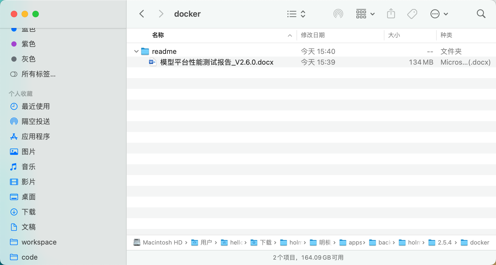
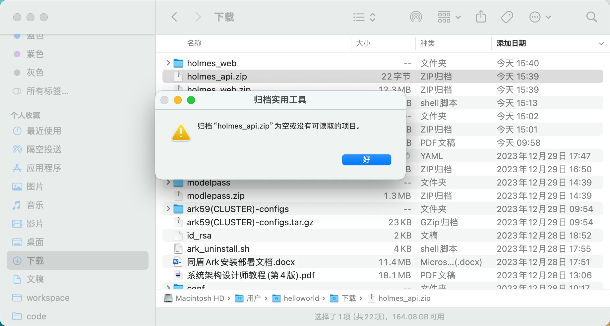

# 明模部署 2.5.4

## mysql

### 初始化sql数据重复 

- enki_turing_dev.sql 重复数据
  
    ```bash
    # 算子表增加任务完成时间字段, turing库
    alter table `t_operator` add `gmt_finished` timestamp NULL DEFAULT NULL COMMENT '任务完成时间' after `status`;
    # 报告记录中新增字段, turing库
    alter table  `t_automl_output` add `report_time` timestamp NULL DEFAULT NULL COMMENT '学习流中生成报告时最新评估报告的时间' after `created_by`;
     
    # 更改实验模型的索引
    ALTER TABLE `t_project_model` DROP INDEX idx_deploy_status;
    ALTER TABLE `t_project_model` DROP INDEX uk_index_name;
    ALTER TABLE `t_project_model` ADD INDEX idx_createdby_name (`created_by`,`name`);
     
    #实验模型构建历史，增加model_id维度索引
    ALTER TABLE `t_model_build_history` ADD INDEX idx_model_id (`model_id`);
    #实验模型评估报告, 删老索引，增加model_id维度索引
    ALTER TABLE `t_model_eval` DROP INDEX uk_idx_name_model_id;
    ALTER TABLE `t_model_eval` ADD INDEX idx_model_id (`model_id`);
    ALTER TABLE `t_model_eval` ADD INDEX idx_model_history_id (`model_history_id`);
    alter table `t_model_eval` add `model_output_list` longtext COMMENT '运行报告总览信息' after `model_history_id`;
     
    # 算子实例表索引优化
    ALTER TABLE `t_operator_instances` DROP INDEX INDEX_instance_type;
    ALTER TABLE `t_operator_instances` ADD INDEX idx_instance_type_status (`instance_type`,`status`);
     
    #模型报告记录表增加字段
    alter table `t_automl_output` add column  `algo_cn_type` varchar(255) DEFAULT NULL COMMENT '模型算法分类' after `algo_type`;
     
    #增加instance_typ类型的描述
    alter table `t_operator_instances` modify  `instance_type` tinyint(1) DEFAULT NULL COMMENT '运行任务类型，0：dag，1:retrain学习流 2:retrain智能建模 3:自定义dag, 4:自定义pysaprk, 7:隐式任务(如交互分箱)';
    
    alter table `t_model_build_history` modify `model_name` varchar(50) NOT NULL COMMENT '模型包名';
     
    # 清理周期任务所引用的学习流
    delete from t_dag where id in (select task.dag_id from t_scheduler_task task where task_type in (1,4));
    
    #######################2314期增量更新#######################
    #调整周期任务表结构
    TRUNCATE t_scheduler_task;
    
    ALTER TABLE t_scheduler_task
        DROP COLUMN pontus_job_id,
        DROP COLUMN operator_code,
        DROP COLUMN table_name,
        DROP COLUMN query_type,
        DROP COLUMN partition_expression_1,
        DROP COLUMN partition_expression_2,
        DROP COLUMN auto_deploy_rule,
        DROP COLUMN model_uuid,
        DROP COLUMN command;
    
    ALTER TABLE t_scheduler_task
        ADD COLUMN automl_id       BIGINT COMMENT '智能建模ID' AFTER dag_id,
        ADD COLUMN task_mode        TINYINT     NOT NULL COMMENT '任务方式 taskType为1时，1 DAG 2 AutoML taskType为2时，1 DAG 2 PySpark' AFTER task_type,
        ADD COLUMN scheduler_type   VARCHAR(24) NOT NULL COMMENT '调度方式' AFTER group_name,
        ADD COLUMN scheduler_switch BOOLEAN COMMENT '调度开关： true：开启 false：关闭' AFTER scheduler_type,
        ADD COLUMN link_to          VARCHAR(1024) COMMENT '监控预警联动对象' ,
        ADD COLUMN alarm_to_users   MEDIUMTEXT COMMENT '告警接收用户',
        ADD COLUMN send_mode VARCHAR(24) COMMENT '告警方式：1 企业微信',
        ADD COLUMN alarm_type VARCHAR(24) COMMENT '告警类型：1 运行失败 3 未达标',
        MODIFY COLUMN cron_expression       varchar(32) NULL COMMENT '执行周期规则，cron表达式';
    
    #调整周期任务记录表结构
    TRUNCATE t_scheduler_record;
    
    ALTER TABLE t_scheduler_record
        DROP COLUMN begin_time, DROP COLUMN over_time, DROP COLUMN cost_time, DROP COLUMN status,
        DROP COLUMN model_path, DROP COLUMN report_path, DROP COLUMN created_by, DROP COLUMN modified_by,
        DROP COLUMN gmt_create, DROP COLUMN gmt_modify, DROP COLUMN model_delete;
    
    ALTER TABLE t_scheduler_record
        ADD COLUMN run_dag_id INTEGER NULL COMMENT '运行的学习流ID' after scheduler_task_id,
        ADD COLUMN evaluation_result MEDIUMTEXT NULL COMMENT '评估结果记录' after run_dag_id,
        ADD COLUMN model_save_result MEDIUMTEXT NULL COMMENT '模型保存情况记录' after evaluation_result; 
    # ----------------------------以上是turing数据---------------------------------
    ```
    
    

## ark

### 文件名称书写错误 param.json → params.json


应该是 params.json


### 执行  [prepare-and-install.sh](http://prepare-and-install.sh) 报错

报错似乎没有影响，应该先安装相关插件 sudo yum install createrepo

```bash
[tongdun@10-57-36-52 prepareyum]$ sh prepare-and-install.sh
./check-and-install.sh:行4: createrepo: 未找到命令
createrepo is not installed, install it first!
/data01/td/arkv2/v2.hadoop2.10.2/vm/prepareyum
警告：/data01/td/arkv2/v2.hadoop2.10.2/vm/prepareyum/bin/deltarpm-3.6-3.el7.x86_64.rpm: 头V3 RSA/SHA256 Signature, 密钥 ID f4a80eb5: NOKEY
准备中...                          ################################# [100%]
正在升级/安装...
   1:deltarpm-3.6-3.el7               ################################# [100%]
警告：/data01/td/arkv2/v2.hadoop2.10.2/vm/prepareyum/bin/python-deltarpm-3.6-3.el7.x86_64.rpm: 头V3 RSA/SHA256 Signature, 密钥 ID f4a80eb5: NOKEY
准备中...                          ################################# [100%]
正在升级/安装...
   1:python-deltarpm-3.6-3.el7        ################################# [100%]
警告：/data01/td/arkv2/v2.hadoop2.10.2/vm/prepareyum/bin/createrepo-0.9.9-28.el7.noarch.rpm: 头V3 RSA/SHA256 Signature, 密钥 ID f4a80eb5: NOKEY
错误：依赖检测失败：
	libxml2-python 被 createrepo-0.9.9-28.el7.noarch 需要
./check-and-install.sh:行14: createrepo: 未找到命令
createrepo installation failed!
./newprepareyum.sh:行5: netstat: 未找到命令
Python 2.7.5
This python 2
nohup: 把输出追加到"nohup.out"
./newprepareyum.sh:行40: createrepo: 未找到命令
./newprepareyum.sh:行43: createrepo: 未找到命令
./newprepareyum.sh:行45: createrepo: 未找到命令
spark2-env.xml.td                             100% 5160     2.9MB/s   00:00
hive-env.xml.td                               100% 8702     7.0MB/s   00:00
yarn-env.xml.td                               100% 9474     7.7MB/s   00:00
hbase-env.xml.td                              100% 7500     7.7MB/s   00:00
zookeeper-env.xml                             100% 3772     5.7MB/s   00:00
yarn-env.xml                                  100% 9474     5.5MB/s   00:00
hive-env.xml                                  100% 8704     6.5MB/s   00:00
hbase-env.xml                                 100% 7500     6.2MB/s   00:00
ambari-default.repo                           100%  254   328.6KB/s   00:00
serverSetup.py.td                             100%   44KB  19.5MB/s   00:00
serverConfiguration.py
```

### TDH版本不一致


### 子节点角色分配规则，文档描述不全面


Livy for Spark2 Server， Spark2 Thrift Server，Client 如何分配呢？

- 本次的分配
  
    
    


### 部署文档：修改livy的配置文件结构有些混乱


上文提到修改livy的配置文件，然后重启livy

下文紧接着就是：如果需要修改ambari-server的日志，防止更目录磁盘写满

而要修改的livy配置是在最后面才出现


## k8s

### 报错 config.ini:行336: 10.58.17.46: 未找到命令

```bash
sh td_install.sh
/data01/td/mm_pkg/subfiles/scripts/config.ini:行336: 10.58.17.46: 未找到命令
>>>>>>>>>>> import config.ini success
find: 警告: 您在非选项参数 -name 后定义了 -maxdepth 选项，但选项不是位置选项 (-maxdepth 影响在它之前或之后的指定的比较测试)。请在其它参数之前指定选项。

find: 警告: 您在非选项参数 -name 后定义了 -maxdepth 选项，但选项不是位置选项 (-maxdepth 影响在它之前或之后的指定的比较测试)。请在其它参数之前指定选项。

>>>>>> infrastructure soft list: mingmo-mofang
>>>>>> yuntu app soft list:
>>>>>> infrastructure soft mingmo-mofang install starting.

==========================================================================
   _____ ______   ___  ________   ________  _____ ______   ________
  |\   _ \  _   \|\  \|\   ___  \|\   ____\|\   _ \  _   \|\   __  \
  \ \  \\\__\ \  \ \  \ \  \\ \  \ \  \___|\ \  \\\__\ \  \ \  \|\  \
   \ \  \\|__| \  \ \  \ \  \\ \  \ \  \  __\ \  \\|__| \  \ \  \\\  \
    \ \  \    \ \  \ \  \ \  \\ \  \ \  \|\  \ \  \    \ \  \ \  \\\  \
     \ \__\    \ \__\ \__\ \__\\ \__\ \_______\ \__\    \ \__\ \_______\
      \|__|     \|__|\|__|\|__| \|__|\|_______|\|__|     \|__|\|_______|

==========================================================================
*************************  mingmo mingmo-mofang install starting
>>>>>> mingmo-mofang install start
>>>>>> 找到安装包 [Find soft package] /data01/td/mm_pkg/apps/apps/infrastructure/mingmo-mofang/1.19-rhel7_x86-v5.2-advanced/vm/mingmo-mofang-v5.2-advanced.zip
Archive:  /data01/td/mm_pkg/apps/apps/infrastructure/mingmo-mofang/1.19-rhel7_x86-v5.2-advanced/vm/mingmo-mofang-v5.2-advanced.zip
  inflating: /data01/td/mm_pkg/subfiles/scripts/install_tmp/mingmo_mofang_pkg/mingmo-mofang.tgz
  inflating: /data01/td/mm_pkg/subfiles/scripts/install_tmp/mingmo_mofang_pkg/mingmo_mofang_install.sh
 extracting: /data01/td/mm_pkg/subfiles/scripts/install_tmp/mingmo_mofang_pkg/mingmodocker
>>>>>> 进入安装包解压后目录 cd /data01/td/mm_pkg/subfiles/scripts/install_tmp/mingmo_mofang_pkg/
>>>>>> 拷贝安装依赖配置 [Copy dependency config file] config.*.ini/td_init_*.sh /data01/td/mm_pkg/subfiles/scripts/td_init_mingmo.sh /data01/td/mm_pkg/subfiles/scripts/config.mingmo.ini
/data01/td/mm_pkg/subfiles/scripts/config.ini
>>>>>>>>>>>>>>>>>>>>>> 拷贝 config.mingmo.ini 配置
find: 警告: 您在非选项参数 -name 后定义了 -maxdepth 选项，但选项不是位置选项 (-maxdepth 影响在它之前或之后的指定的比较测试)。请在其它参数之前指定选项。

/data01/td/mm_pkg/subfiles/scripts/install_tmp/mingmo_mofang_pkg/config.ini:行336: 10.58.17.46: 未找到命令
>>>>>>>>>>> import config.ini success
>>>>>>>>>>>>>>>>>>>>>> mofang检查开始，继续安装
ERROR: Config param MINGMO_MOFANG_NODE_IP is empty or is null，cannot continue.process exit 1.
>>>>>>  mingmo-mofang install end
>>>>>> infrastructure soft mingmo-mofang install finished.
>>>>>>
>>>>>> execute install finished.
```

原因是：修改的配置文件中，多个ip之间没有加 逗号

[https://www.notion.so](https://www.notion.so)

```bash
################# mingmo-mofang 安装配置 start #####################################
#安装的机器列表
MINGMO_MOFANG_INSTALL_HOSTS=10.58.17.48
#需要部署成master的节点ip(master 必须为基数个!)
MINGMO_MOFANG_MASTER_IP=10.58.17.48
#需要部署成node的节点ip master和node可以⼀样也可以不⼀样
MINGMO_MOFANG_NODE_IP=10.58.17.48,10.58.17.46,10.58.17.47
#虚拟IP，提前跟客户申请，master的负载ip，该ip不能被使⽤。
MINGMO_MOFANG_NODE_MVIP=10.58.17.48
#安装时非必填，默认$BASE_PATH/mingmo-mofang/magickube目录,卸载的时候需要填写
MINGMO_K8S_DIR=$BASE_PATH/mingmo-mofang/magickube
################# mingmo-mofang 安装配置 end #####################################
```


## mingmo-k8s-yaml

### 疑问: 安装魔方的时候也做过一次 namespace的创建，为什么这里还要创建

安装魔方时的：


mingmo-k8s-yaml


```bash
# 安装魔方时创建的命名空间
kubectl apply -f yaml/namespace/namespace_turing_jupyter.yaml 成功
NAME              STATUS   AGE
apps              Active   1s
default           Active   33m
holmes            Active   0s
ingress-nginx     Active   28m
job               Active   1s
kube-node-lease   Active   33m
kube-public       Active   33m
kube-system       Active   33m
middleware        Active   0s
td-prometheus     Active   28m
turing-jupyter    Active   0s

# mingmo-k8s-yaml
kubectl apply -f yaml/namespace/namespace_modelpaas.yaml 成功
NAME              STATUS   AGE
apps              Active   15m
default           Active   48m
holmes            Active   15m
ingress-nginx     Active   44m
job               Active   15m
kube-node-lease   Active   48m
kube-public       Active   48m
kube-system       Active   48m
middleware        Active   15m
model-paas        Active   0s
td-prometheus     Active   43m
turing-jupyter    Active   15m
node/10.58.17.46 labeled
node/10.58.17.47 labeled
node/10.58.17.48 labeled
```


## presto

### 安装报错

- 报错信息
  
    ```bash
    [tdops@enki-hadoop-d-010058017048 scripts]$ sh td_install.sh
    >>>>>>>>>>> import config.ini success
    find: 警告: 您在非选项参数 -name 后定义了 -maxdepth 选项，但选项不是位置选项 (-maxdepth 影响在它之前或之后的指定的比较测试)。请在其它参数之前指定选项。
    
    find: 警告: 您在非选项参数 -name 后定义了 -maxdepth 选项，但选项不是位置选项 (-maxdepth 影响在它之前或之后的指定的比较测试)。请在其它参数之前指定选项。
    
    >>>>>> infrastructure soft list: presto
    >>>>>> yuntu app soft list:
    >>>>>> infrastructure soft presto install starting.
    
    ==========================================================================
       _____ ______   ___  ________   ________  _____ ______   ________
      |\   _ \  _   \|\  \|\   ___  \|\   ____\|\   _ \  _   \|\   __  \
      \ \  \\\__\ \  \ \  \ \  \\ \  \ \  \___|\ \  \\\__\ \  \ \  \|\  \
       \ \  \\|__| \  \ \  \ \  \\ \  \ \  \  __\ \  \\|__| \  \ \  \\\  \
        \ \  \    \ \  \ \  \ \  \\ \  \ \  \|\  \ \  \    \ \  \ \  \\\  \
         \ \__\    \ \__\ \__\ \__\\ \__\ \_______\ \__\    \ \__\ \_______\
          \|__|     \|__|\|__|\|__| \|__|\|_______|\|__|     \|__|\|_______|
    
    ==========================================================================
    *************************  mingmo presto install starting
    >>>>>> presto install start
    >>>>>> 找到安装包 [Find soft package] /data01/td/mm_pkg/apps/apps/infrastructure/presto/0.355-advanced-sp01/vm/presto-355_advanced.zip.02
    /data01/td/mm_pkg/apps/apps/infrastructure/presto/0.355-advanced-sp01/vm/presto-355_advanced.zip.05
    /data01/td/mm_pkg/apps/apps/infrastructure/presto/0.355-advanced-sp01/vm/presto-355_advanced.zip.04
    /data01/td/mm_pkg/apps/apps/infrastructure/presto/0.355-advanced-sp01/vm/presto-355_advanced.zip.03
    /data01/td/mm_pkg/apps/apps/infrastructure/presto/0.355-advanced-sp01/vm/presto-355_advanced.zip.06
    /data01/td/mm_pkg/apps/apps/infrastructure/presto/0.355-advanced-sp01/vm/presto-355_advanced.zip.01
    /data01/td/mm_pkg/apps/apps/infrastructure/presto/0.355-advanced-sp01/vm/presto-355_advanced.zip.07
    /data01/td/mm_pkg/apps/apps/infrastructure/presto/0.355-advanced-sp01/vm/presto-355_advanced.zip
    >>>>>> 解压安装包 [Unzip package] /data01/td/mm_pkg/apps/apps/infrastructure/presto/0.355-advanced-sp01/vm/presto-355_advanced.zip.02
    /data01/td/mm_pkg/apps/apps/infrastructure/presto/0.355-advanced-sp01/vm/presto-355_advanced.zip.05
    /data01/td/mm_pkg/apps/apps/infrastructure/presto/0.355-advanced-sp01/vm/presto-355_advanced.zip.04
    /data01/td/mm_pkg/apps/apps/infrastructure/presto/0.355-advanced-sp01/vm/presto-355_advanced.zip.03
    /data01/td/mm_pkg/apps/apps/infrastructure/presto/0.355-advanced-sp01/vm/presto-355_advanced.zip.06
    /data01/td/mm_pkg/apps/apps/infrastructure/presto/0.355-advanced-sp01/vm/presto-355_advanced.zip.01
    /data01/td/mm_pkg/apps/apps/infrastructure/presto/0.355-advanced-sp01/vm/presto-355_advanced.zip.07
    /data01/td/mm_pkg/apps/apps/infrastructure/presto/0.355-advanced-sp01/vm/presto-355_advanced.zip to
    Archive:  /data01/td/mm_pkg/apps/apps/infrastructure/presto/0.355-advanced-sp01/vm/presto-355_advanced.zip.02
      End-of-central-directory signature not found.  Either this file is not
      a zipfile, or it constitutes one disk of a multi-part archive.  In the
      latter case the central directory and zipfile comment will be found on
      the last disk(s) of this archive.
    unzip:  cannot find zipfile directory in one of /data01/td/mm_pkg/apps/apps/infrastructure/presto/0.355-advanced-sp01/vm/presto-355_advanced.zip.02 or
            /data01/td/mm_pkg/apps/apps/infrastructure/presto/0.355-advanced-sp01/vm/presto-355_advanced.zip.02.zip, and cannot find /data01/td/mm_pkg/apps/apps/infrastructure/presto/0.355-advanced-sp01/vm/presto-355_advanced.zip.02.ZIP, period.
    >>>>>> 进入安装包解压后目录 cd /data01/td/mm_pkg/subfiles/scripts/install_tmp/presto_pkg/
    >>>>>> 拷贝安装依赖配置 [Copy dependency config file] config.*.ini/td_init_*.sh /data01/td/mm_pkg/subfiles/scripts/td_init_mingmo.sh /data01/td/mm_pkg/subfiles/scripts/config.mingmo.ini
    /data01/td/mm_pkg/subfiles/scripts/config.ini
    >>>>>>>>>>>>>>>>>>>>>> 拷贝 config.mingmo.ini 配置
    find: 警告: 您在非选项参数 -name 后定义了 -maxdepth 选项，但选项不是位置选项 (-maxdepth 影响在它之前或之后的指定的比较测试)。请在其它参数之前指定选项。
    
    sh: presto_install.sh: 没有那个文件或目录
    >>>>>>  presto install end
    >>>>>> infrastructure soft presto install finished.
    >>>>>>
    >>>>>> execute install finished.
    ```
    
- 查看 ls /data01/td/mm_pkg/apps/apps/infrastructure/presto/0.355-advanced-sp01/vm
  
    ```bash
    [tdops@enki-hadoop-d-010058017048 scripts]$ ls  /data01/td/mm_pkg/apps/apps/infrastructure/presto/0.355-advanced-sp01/vm
    presto-355_advanced.zip     presto-355_advanced.zip.05
    presto-355_advanced.zip.01  presto-355_advanced.zip.06
    presto-355_advanced.zip.02  presto-355_advanced.zip.07
    presto-355_advanced.zip.03  readme
    presto-355_advanced.zip.04
    ```
    
    ```bash
    # 删除wenj
    
    [tdops@enki-hadoop-d-010058017048 vm]$ rm -rf presto-355_advanced.zip.0*
    [tdops@enki-hadoop-d-010058017048 vm]$ ls
    presto-355_advanced.zip  readme
    [tdops@enki-hadoop-d-010058017048 vm]$
    ```
    
- 再次执行安装 再次把报错
  
    错误原因：交付物中的目录名称不正确  presto-355.zip
    
    ```bash
    [tdops@enki-hadoop-d-010058017048 scripts]$ sh td_install.sh
    >>>>>>>>>>> import config.ini success
    find: 警告: 您在非选项参数 -name 后定义了 -maxdepth 选项，但选项不是位置选项 (-maxdepth 影响在它之前或之后的指定的比较测试)。请在其它参数之前指定选项。
    
    find: 警告: 您在非选项参数 -name 后定义了 -maxdepth 选项，但选项不是位置选项 (-maxdepth 影响在它之前或之后的指定的比较测试)。请在其它参数之前指定选项。
    
    >>>>>> infrastructure soft list: presto
    >>>>>> yuntu app soft list:
    >>>>>> infrastructure soft presto install starting.
    
    ==========================================================================
       _____ ______   ___  ________   ________  _____ ______   ________
      |\   _ \  _   \|\  \|\   ___  \|\   ____\|\   _ \  _   \|\   __  \
      \ \  \\\__\ \  \ \  \ \  \\ \  \ \  \___|\ \  \\\__\ \  \ \  \|\  \
       \ \  \\|__| \  \ \  \ \  \\ \  \ \  \  __\ \  \\|__| \  \ \  \\\  \
        \ \  \    \ \  \ \  \ \  \\ \  \ \  \|\  \ \  \    \ \  \ \  \\\  \
         \ \__\    \ \__\ \__\ \__\\ \__\ \_______\ \__\    \ \__\ \_______\
          \|__|     \|__|\|__|\|__| \|__|\|_______|\|__|     \|__|\|_______|
    
    ==========================================================================
    *************************  mingmo presto install starting
    >>>>>> presto install start
    >>>>>> 找到安装包 [Find soft package] /data01/td/mm_pkg/apps/apps/infrastructure/presto/0.355-advanced-sp01/vm/presto-355_advanced.zip
    >>>>>> 解压安装包 [Unzip package] /data01/td/mm_pkg/apps/apps/infrastructure/presto/0.355-advanced-sp01/vm/presto-355_advanced.zip to
    Archive:  /data01/td/mm_pkg/apps/apps/infrastructure/presto/0.355-advanced-sp01/vm/presto-355_advanced.zip
       creating: /data01/td/mm_pkg/subfiles/scripts/install_tmp/presto_pkg/conf/
      inflating: /data01/td/mm_pkg/subfiles/scripts/install_tmp/presto_pkg/conf/hive.properties
      inflating: /data01/td/mm_pkg/subfiles/scripts/install_tmp/presto_pkg/conf/config.properties.worker
      inflating: /data01/td/mm_pkg/subfiles/scripts/install_tmp/presto_pkg/conf/config.properties.coordinator
      inflating: /data01/td/mm_pkg/subfiles/scripts/install_tmp/presto_pkg/conf/node.properties
      inflating: /data01/td/mm_pkg/subfiles/scripts/install_tmp/presto_pkg/conf/mysql.properties
      inflating: /data01/td/mm_pkg/subfiles/scripts/install_tmp/presto_pkg/conf/jvm.config
      inflating: /data01/td/mm_pkg/subfiles/scripts/install_tmp/presto_pkg/conf/log.properties
       creating: /data01/td/mm_pkg/subfiles/scripts/install_tmp/presto_pkg/presto-355/
      inflating: /data01/td/mm_pkg/subfiles/scripts/install_tmp/presto_pkg/presto-355/presto-server-355.tar.gz
      inflating: /data01/td/mm_pkg/subfiles/scripts/install_tmp/presto_pkg/presto-355/.DS_Store
      inflating: /data01/td/mm_pkg/subfiles/scripts/install_tmp/presto_pkg/presto-355/presto-cli.tgz
      inflating: /data01/td/mm_pkg/subfiles/scripts/install_tmp/presto_pkg/presto-355/jdk-11.0.19-linux_x64.tar.gz
      inflating: /data01/td/mm_pkg/subfiles/scripts/install_tmp/presto_pkg/presto_install.sh
    >>>>>> 进入安装包解压后目录 cd /data01/td/mm_pkg/subfiles/scripts/install_tmp/presto_pkg/
    >>>>>> 拷贝安装依赖配置 [Copy dependency config file] config.*.ini/td_init_*.sh /data01/td/mm_pkg/subfiles/scripts/td_init_mingmo.sh /data01/td/mm_pkg/subfiles/scripts/config.mingmo.ini
    /data01/td/mm_pkg/subfiles/scripts/config.ini
    >>>>>>>>>>>>>>>>>>>>>> 拷贝 config.mingmo.ini 配置
    find: 警告: 您在非选项参数 -name 后定义了 -maxdepth 选项，但选项不是位置选项 (-maxdepth 影响在它之前或之后的指定的比较测试)。请在其它参数之前指定选项。
    
    >>>>>>>>>>> import config.ini success
    >>>>>>>>>>> import config.mingmo.ini success.
    >>>>>>>>>>> import td_init_mingmo.sh success.
    >>>>>>>>>>>>>>>>>>>>>> presto检查开始，继续安装
    ERROR: File /data01/td/mm_pkg/subfiles/scripts/install_tmp/presto_pkg/presto-355.zip not exist，cannot continue.process exit 1.
    >>>>>>  presto install end
    >>>>>> infrastructure soft presto install finished.
    >>>>>>
    >>>>>> execute install finished.
    [tdops@enki-hadoop-d-010058017048 script
    ```
    
- presto发现服务的uri不是指定的ip
  
    [http://10.57.36.59:8082/ui/](http://10.57.36.59:8082/ui/)
    
    [http://10.57.36.60:8082/ui/](http://10.57.36.60:8082/ui/)
    
    
    
    
    

## mingmo-hadoop, nfs

### 安装日志提示：mingmo-hdfs-conda2’: 没有那个文件或目录, mingmo_hadoop_pkg/" 后缺少了要操作的目标文件

```bash
==========================================================================
*************************  mingmo mingmo-hadoop install starting
>>>>>> mingmo-hadoop install start
>>>>>> 找到安装包 [Find soft package] /data01/td/mm_pkg/apps/apps/infrastructure/mingmo-hadoop/hadoop-2.7.7-advanced-v2.5.3-sp01/vm/mingmo-hadoop-2.7.7-advanced-v2.5.3.zip
rm: 无法删除"/data01/td/mm_pkg/subfiles/scripts/install_tmp/mingmo_hadoop_pkg/": 没有那个文件或目录
Archive:  /data01/td/mm_pkg/apps/apps/infrastructure/mingmo-hadoop/hadoop-2.7.7-advanced-v2.5.3-sp01/vm/mingmo-hadoop-2.7.7-advanced-v2.5.3.zip
  inflating: /data01/td/mm_pkg/subfiles/scripts/install_tmp/mingmo_hadoop_pkg/hadoop_install.sh
  inflating: /data01/td/mm_pkg/subfiles/scripts/install_tmp/mingmo_hadoop_pkg/mingmo-hadoop.tgz
find: ‘/data01/td/mm_pkg/apps/apps/infrastructure/mingmo-hdfs-conda2’: 没有那个文件或目录
cp: 在"/data01/td/mm_pkg/subfiles/scripts/install_tmp/mingmo_hadoop_pkg/" 后缺少了要操作的目标文件
Try 'cp --help' for more information.
>>>>>> 进入安装包解压后目录 cd /data01/td/mm_pkg/subfiles/scripts/install_tmp/mingmo_hadoop_pkg/
>>>>>> 拷贝安装依赖配置 [Copy dependency config file] config.*.ini/td_init_*.sh /data01/td/mm_pkg/subfiles/scripts/td_init_mingmo.sh /data01/td/mm_pkg/subfiles/scripts/config.mingmo.ini
/data01/td/mm_pkg/subfiles/scripts/config.ini
>>>>>>>>>>>>>>>>>>>>>> 拷贝 config.mingmo.ini 配置
find: 警告: 您在非选项参数 -name 后定义了 -maxdepth 选项，但选项不是位置选项 (-maxdepth 影响在它之前或之后的指定的比较测试)。请在其它参数之前指定选项。

>>>>>>>>>>> import config.ini success
>>>>>>>>>>> import config.mingmo.ini success.
>>>>>>>>>>> import td_init_mingmo.sh success.
>>>>>>>>>>>>>>>>>>>>>> hadoop检查开始，继续安装
```

### 脚本文件名拼写错误 anaconda3.zip not exist

```bash
>>>>>>>>>>>>>>>>>>>>>> hadoop检查开始，继续安装
File /data01/td/conf/core-site.xml exists.
File /data01/td/conf/hdfs-site.xml exists.
File /data01/td/conf/yarn-site.xml exists.
File /data01/td/conf/hive-site.xml exists.
mingmo-hadoop/
mingmo-hadoop/hadoop-2.7.7.tar.gz
mingmo-hadoop/jdk-8u171-linux-x64.tar
mingmo-hadoop/hdfs_add.sh
mingmo-hadoop/hdfs_add_kerberos.sh
ERROR: File /data01/td/mm_pkg/subfiles/scripts/install_tmp/mingmo_hadoop_pkg/anaconda3.zip not exist，cannot continue.process exit 1.
>>>>>>  mingmo-hadoop、hdfs install end
>>>>>> infrastructure soft mingmo-hadoop install finished.
>>>>>>
>>>>>> execute install finished.
[tdops@enki-hadoop-d-010058017048 scripts]$ ls /data01/td/mm_pkg/subfiles/scripts/install_tmp/mingmo_hadoop_pkg
anaconda3.7.zip     config.ini         hadoop_install.sh  mingmo-hadoop.tgz       mingmo-hdfs-hive.zip   mingmo-hdfs-turing.zip
common_function.sh  config.mingmo.ini  mingmo-hadoop      mingmo-hdfs-appjar.tgz  mingmo-hdfs-other.zip  td_init_mingmo.sh
```

### put: mingmo-hdfs-other/yarn_jars': No such file or directory hadoop fs -put -f mingmo-hdfs-other/jdbc /user/turing/algorithm/prod/ put: mingmo-hdfs-other/jdbc': No such file or directory

```bash
>>>>>>>>>>>>>>>>>>>>>> Mingmo-hdfs-conda2/3 put
hadoop fs -mkdir -p /user/turing/conda/
hadoop fs -put -f anaconda3.zip /user/turing/conda/
put: `anaconda3.zip': No such file or directory
hadoop fs -ls /user/turing/conda/
>>>>>>>>>>>>>>>>>>>>>> Mingmo-hdfs-turing put
hadoop fs -mkdir -p /user/turing/algorithm/prod/
hadoop fs -put -f mingmo-hdfs-turing/algoso  /user/turing/algorithm/prod/
put: `mingmo-hdfs-turing/algoso': No such file or directory
hadoop fs -put -f mingmo-hdfs-turing/depends /user/turing/algorithm/prod/
put: `mingmo-hdfs-turing/depends': No such file or directory
>>>>>>>>>>>>>>>>>>>>>> Mingmo-hdfs-other put
hadoop fs -mkdir -p /user/turing/data/
hadoop fs -mkdir -p /user/turing/algorithm/prod/algoso
hadoop fs -put -f mingmo-hdfs-other/public /user/turing/data
put: `mingmo-hdfs-other/public': No such file or directory
hadoop fs -put -f mingmo-hdfs-other/yarn_jars /user/turing/data
put: `mingmo-hdfs-other/yarn_jars': No such file or directory
hadoop fs -put -f mingmo-hdfs-other/jdbc /user/turing/algorithm/prod/
put: `mingmo-hdfs-other/jdbc': No such file or directory
hadoop fs -ls /user/turing/data
>>>>>>>>>>>>>>>>>>>>>> Mingmo-hdfs-appjar put
hadoop fs -put -f mingmo-hdfs-appjar/modelpaas /user/turing/algorithm/prod/
hadoop fs -put -f mingmo-hdfs-appjar/exchange/* /user/turing/algorithm/prod/algoso/
>>>>>>>>>>>>>>>>>>>>>> Mingmo-hdfs-hive
sed：无法读取 /data01/td/infra/mingmo-hadoop/mingmo-hdfs-hive/hive_tables_message_no_location.txt：没有那个文件或目录
beeline -u jdbc:hive2://10.57.36.60:10000/default -n hive -p 123456 -f /data01/td/infra/mingmo-hadoop/mingmo-hdfs-hive/hive_tables_message_no_location.txt
./hadoop_install.sh:行248: beeline: 未找到命令
mingmo-hadoop、hdfs instance is started.
```

## mingmo-spark

### sh: mingmo_spark_install.sh: 没有那个文件或目录

```bash
[tdops@enki-hadoop-d-010058017048 scripts]$ sh td_install.sh
>>>>>>>>>>> import config.ini success
find: 警告: 您在非选项参数 -name 后定义了 -maxdepth 选项，但选项不是位置选项 (-maxdepth 影响在它之前或之后的指定的比较测试)。请在其它参数之前指定选项。

find: 警告: 您在非选项参数 -name 后定义了 -maxdepth 选项，但选项不是位置选项 (-maxdepth 影响在它之前或之后的指定的比较测试)。请在其它参数之前指定选项。

>>>>>> infrastructure soft list: mingmo-spark
>>>>>> yuntu app soft list:
>>>>>> infrastructure soft mingmo-spark install starting.

==========================================================================
   _____ ______   ___  ________   ________  _____ ______   ________
  |\   _ \  _   \|\  \|\   ___  \|\   ____\|\   _ \  _   \|\   __  \
  \ \  \\\__\ \  \ \  \ \  \\ \  \ \  \___|\ \  \\\__\ \  \ \  \|\  \
   \ \  \\|__| \  \ \  \ \  \\ \  \ \  \  __\ \  \\|__| \  \ \  \\\  \
    \ \  \    \ \  \ \  \ \  \\ \  \ \  \|\  \ \  \    \ \  \ \  \\\  \
     \ \__\    \ \__\ \__\ \__\\ \__\ \_______\ \__\    \ \__\ \_______\
      \|__|     \|__|\|__|\|__| \|__|\|_______|\|__|     \|__|\|_______|

==========================================================================
*************************  mingmo mingmo-spark install starting
>>>>>> mingmo-spark install start
dirname: 缺少操作数
Try 'dirname --help' for more information.
>>>>>> 找到安装包 [Find soft package]
rm: 无法删除"/data01/td/mm_pkg/subfiles/scripts/install_tmp/mingmo_spark_pkg/": 没有那个文件或目录
UnZip 6.00 of 20 April 2009, by Info-ZIP.  Maintained by C. Spieler.  Send
bug reports using http://www.info-zip.org/zip-bug.html; see README for details.

Usage: unzip [-Z] [-opts[modifiers]] file[.zip] [list] [-x xlist] [-d exdir]
  Default action is to extract files in list, except those in xlist, to exdir;
  file[.zip] may be a wildcard.  -Z => ZipInfo mode ("unzip -Z" for usage).

  -p  extract files to pipe, no messages     -l  list files (short format)
  -f  freshen existing files, create none    -t  test compressed archive data
  -u  update files, create if necessary      -z  display archive comment only
  -v  list verbosely/show version info       -T  timestamp archive to latest
  -x  exclude files that follow (in xlist)   -d  extract files into exdir
modifiers:
  -n  never overwrite existing files         -q  quiet mode (-qq => quieter)
  -o  overwrite files WITHOUT prompting      -a  auto-convert any text files
  -j  junk paths (do not make directories)   -aa treat ALL files as text
  -U  use escapes for all non-ASCII Unicode  -UU ignore any Unicode fields
  -C  match filenames case-insensitively     -L  make (some) names lowercase
  -X  restore UID/GID info                   -V  retain VMS version numbers
  -K  keep setuid/setgid/tacky permissions   -M  pipe through "more" pager
  -O CHARSET  specify a character encoding for DOS, Windows and OS/2 archives
  -I CHARSET  specify a character encoding for UNIX and other archives

See "unzip -hh" or unzip.txt for more help.  Examples:
  unzip data1 -x joe   => extract all files except joe from zipfile data1.zip
  unzip -p foo | more  => send contents of foo.zip via pipe into program more
  unzip -fo foo ReadMe => quietly replace existing ReadMe if archive file newer
>>>>>> 进入安装包解压后目录 cd /data01/td/mm_pkg/subfiles/scripts/install_tmp/mingmo_spark_pkg/
>>>>>> 拷贝安装依赖配置 [Copy dependency config file] config.*.ini/td_init_*.sh /data01/td/mm_pkg/subfiles/scripts/td_init_mingmo.sh /data01/td/mm_pkg/subfiles/scripts/config.mingmo.ini
/data01/td/mm_pkg/subfiles/scripts/config.ini
>>>>>>>>>>>>>>>>>>>>>> 拷贝 config.mingmo.ini 配置
find: 警告: 您在非选项参数 -name 后定义了 -maxdepth 选项，但选项不是位置选项 (-maxdepth 影响在它之前或之后的指定的比较测试)。请在其它参数之前指定选项。

sh: mingmo_spark_install.sh: 没有那个文件或目录
>>>>>>  mingmo-spark install end
>>>>>> infrastructure soft mingmo-spark install finished.
>>>>>>
>>>>>> execute install finished
```

## 前后端

```bash
安装用户: tdops
安装目录: /data01/td
前后端目录: /data01/td/mingmo-apps
安装机器: 10.58.17.47
执行操作: install_image
```

### mingmo_apps_install.sh: 第 22 行:cd: apps/apps/backend: 没有那个文件或目录

```bash
>>>>>> mingmo-front-apps install start
>>>>>> 找到安装包 [Find soft package]
rm: 无法删除"/data01/td/mm_pkg/subfiles/scripts/install_tmp/mingmo_front_apps_pkg/": 没有那个文件或目录
>>>>>> 进入安装包解压后目录 cd /data01/td/mm_pkg/subfiles/scripts/install_tmp/mingmo_front_apps_pkg/
>>>>>> 拷贝安装依赖配置 [Copy dependency config file] config.*.ini/td_init_*.sh /data01/td/mm_pkg/subfiles/scripts/td_init_mingmo.sh /data01/td/mm_pkg/subfiles/scripts/config.ini
/data01/td/mm_pkg/subfiles/scripts/config.mingmo.ini
>>>>>>>>>>>>>>>>>>>>>> 拷贝 config.mingmo.ini 配置
find: 警告: 您在非选项参数 -name 后定义了 -maxdepth 选项，但选项不是位置选项 (-maxdepth 影响在它之前或之后的指定的比较测试)。请在其它参数之前指定选项。

mingmo_apps_install.sh: 第 22 行:cd: apps/apps/backend: 没有那个文件或目录
calculate backend base path is: /data01/td/mm_pkg/subfiles/scripts
>>>>>>>>>>> import config.ini success
>>>>>>>>>>> import config.mingmo.ini success.
>>>>>>>>>>> import td_init_mingmo.sh success.
>>>>>>>>>>>>>>>>>>>>>> apps检查开始，继续安装
```

### find: ‘/data01/install_internal_image’: 没有那个文件或目录

```bash
==========================================================================
*************************  mingmo mingmo-front-apps install starting
>>>>>> mingmo-front-apps install start
>>>>>> 找到安装包 [Find soft package]
rm: 无法删除"/data01/td/mm_pkg/subfiles/scripts/install_tmp/mingmo_front_apps_pkg/": 没有那个文件或目录
>>>>>> 进入安装包解压后目录 cd /data01/td/mm_pkg/subfiles/scripts/install_tmp/mingmo_front_apps_pkg/
>>>>>> 拷贝安装依赖配置 [Copy dependency config file] config.*.ini/td_init_*.sh /data01/td/mm_pkg/subfiles/scripts/td_init_mingmo.sh /data01/td/mm_pkg/subfiles/scripts/config.ini
/data01/td/mm_pkg/subfiles/scripts/config.mingmo.ini
>>>>>>>>>>>>>>>>>>>>>> 拷贝 config.mingmo.ini 配置
find: 警告: 您在非选项参数 -name 后定义了 -maxdepth 选项，但选项不是位置选项 (-maxdepth 影响在它之前或之后的指定的比较测试)。请在其它参数之前指定选项。

mingmo_apps_install.sh: 第 22 行:cd: apps/apps/backend: 没有那个文件或目录
calculate backend base path is: /data01/td/mm_pkg/subfiles/scripts
>>>>>>>>>>> import config.ini success
>>>>>>>>>>> import config.mingmo.ini success.
>>>>>>>>>>> import td_init_mingmo.sh success.
>>>>>>>>>>>>>>>>>>>>>> apps检查开始，继续安装

安装用户: tdops
安装目录: /data01/td
前后端目录: /data01/td/mingmo-apps
安装机器: 10.58.17.47
执行操作: install_image

检查配置是否正确，并继续执行? [y/n]y
copy files , mingmo_apps_install.sh to 10.58.17.47:/data01/td/mingmo-apps
fiona:20231128-6fe559aac32-img.tar.gz         100%  335MB 111.5MB/s   00:03
模型平台性能测试报告_V2.6.0.docx    100%  128MB 133.5MB/s   00:00
turing-xflow:20231201-dd9db718df0-img.tar.gz  100%  392MB 130.7MB/s   00:03
model-paas:20231201-1452879c643-img.tar.gz    100%  459MB 126.7MB/s   00:03
turing:20231201-491ad13b93c-img.tar.gz        100%  437MB 123.0MB/s   00:03
holmes-python-qiye#feature-2-5-4-2323-new-img 100% 1274MB 115.8MB/s   00:11
monitor-center:20231201-4a6711a66e1-img.tar.g 100%  413MB 137.7MB/s   00:03
bifrost#dev-2-6-0-tiance-2308-7724f60b8c1-img 100%  458MB 118.6MB/s   00:03
chaos:20231201-2b18bb838dd-img.tar.gz         100%  430MB 143.2MB/s   00:03
chaos.yaml                                    100% 2522     3.6MB/s   00:00
mingmo-databi:20231127-abb603a89b3-img.tar.gz 100%  501MB 125.4MB/s   00:04
lightbox-react#feature-2-5-4-2323-img.tar.gz  100% 4514KB 113.1MB/s   00:00
model-paas-react#feature-2-5-4-2323-05d25e8a9 100%   24MB 120.9MB/s   00:00
bifrost-react#feature-2-5-4-2323-c8670a80756- 100% 8594KB 126.3MB/s   00:00
holmes-react#feature-2-5-4-2323-b52f0d9db47-i 100%   13MB 129.6MB/s   00:00
turing-new-react#feature-2-5-4-2323-e3b6f3eb0 100%   19MB 129.3MB/s   00:00
mingmo-react#1.0.0-img.tar.gz                 100%  288MB 120.1MB/s   00:02
chaos-react#feature-2-5-4-2323-8324c367161-im 100%   12MB 116.6MB/s   00:00
turing-doc-en#2.5.4.2323-img.tar.gz           100%   40MB 117.7MB/s   00:00
turing-doc#2.5.4.2323-img.tar.gz              100%   39MB 105.7MB/s   00:00
fiona-react#feature-2-5-4-2323-72dab1fb7ae-im 100% 7795KB  97.0MB/s   00:00
databi-frontend#feature-2-5-4-2323-201a970461 100%   14MB 128.3MB/s   00:00
cri-helper.tgz                                100% 1899     2.1MB/s   00:00
mingmo-yaml.tgz                               100% 4477     5.9MB/s   00:00
mingmo_apps_install.sh                        100% 9969    10.7MB/s   00:00
config.mingmo.ini                             100%   12KB  12.2MB/s   00:00
td_init_mingmo.sh                             100% 9625    10.3MB/s   00:00
copy files config.ini,common_function.sh to 10.58.17.47:/data01/td/mingmo-apps
config.ini                                    100%   19KB  13.2MB/s   00:00
common_function.sh                            100%   16KB  12.5MB/s   00:00
./mingmo_apps_install.sh: 第 22 行:cd: apps/apps/backend: 没有那个文件或目录
calculate backend base path is: /data01
>>>>>>>>>>> import config.ini success
>>>>>>>>>>> import config.mingmo.ini success.
>>>>>>>>>>> import td_init_mingmo.sh success.

==========================================================================
   _____ ______   ___  ________   ________  _____ ______   ________
  |\   _ \  _   \|\  \|\   ___  \|\   ____\|\   _ \  _   \|\   __  \
  \ \  \\\__\ \  \ \  \ \  \\ \  \ \  \___|\ \  \\\__\ \  \ \  \|\  \
   \ \  \\|__| \  \ \  \ \  \\ \  \ \  \  __\ \  \\|__| \  \ \  \\\  \
    \ \  \    \ \  \ \  \ \  \\ \  \ \  \|\  \ \  \    \ \  \ \  \\\  \
     \ \__\    \ \__\ \__\ \__\\ \__\ \_______\ \__\    \ \__\ \_______\
      \|__|     \|__|\|__|\|__| \|__|\|_______|\|__|     \|__|\|_______|

==========================================================================
*************************  mingmo install_internal_image 10.58.17.47 starting
>>>>>> Find package from:/data01/install_internal_image
>>>>>>
find: ‘/data01/install_internal_image’: 没有那个文件或目录
>>>>>> Found pakcage:
>>>>>>
dirname: 缺少操作数
Try 'dirname --help' for more information.
>>>>>> current operate install_internal_image temp dir：/data01/td/mingmo-apps/install_tmp/install_internal_image_pkg
>>>>>>
>>>>>>  tar -zxvf   package……
>>>>>>
tar (child): -C：无法 open: 没有那个文件或目录
tar (child): Error is not recoverable: exiting now
tar: Child returned status 2
tar: Error is not recoverable: exiting now
>>>>>> scan current file list.
>>>>>>>>>>>>>>>>>>>>>> 拷贝 config.mingmo.ini 配置
>>>>>>>>>>>>>>>>>>>>>> 拷贝 td_init_mingmo.sh 定制化安装函数
>>>>>>  Execute install_internal_image_install.sh 10.58.17.47
>>>>>>
sh: install_internal_image_install.sh: 没有那个文件或目录
>>>>>> Execute install_internal_image_install.sh 10.58.17.47 finished.
>>>>>>
mingmo_apps_install.sh execute finished.
mingmo_apps_install.sh execute finished.
>>>>>>  mingmo_front_apps install end
>>>>>> infrastructure soft mingmo-front-apps install finished.
>>>>>>
>>>>>> execute install finished.
```

### 镜像导入失败 fiona，turing-xflow，model-paas, turing, monitor-center, chaos, mingmo-databi, holmes-react

```bash
10.58.17.47 installed, now start config ...
>>>>>> 导入前后端镜像：sudo sh loadAndPush.sh 10.58.17.48:55000
开始导入 ../apps/backend/ 目录下的所有镜像
开始导入 ../apps/backend/fiona/feature-2-5-4-2323/docker/fiona:20231128-6fe559aac32-img.tar.gz
Loaded image: registry.hz.td/cd/fiona:20231128-6fe559aac32
../apps/backend/fiona/feature-2-5-4-2323/docker/fiona:20231128-6fe559aac32-img.tar.gz  镜像导入完毕
parsed tag is fiona:20231128-6fe559aac32
retag 10.58.12.6:4001/cd/fiona:20231128-6fe559aac32 to  10.58.17.48:55000/cd/fiona:20231128-6fe559aac32
Error response from daemon: No such image: 10.58.12.6:4001/cd/fiona:20231128-6fe559aac32
The push refers to repository [10.58.17.48:55000/cd/fiona]
An image does not exist locally with the tag: 10.58.17.48:55000/cd/fiona
push  10.58.17.48:55000/cd/fiona:latest to docker register
Error response from daemon: No such image: 10.58.17.48:55000/cd/fiona:20231128-6fe559aac32
The push refers to repository [10.58.17.48:55000/cd/fiona]
An image does not exist locally with the tag: 10.58.17.48:55000/cd/fiona
开始导入 ../apps/backend/turing-xflow/feature-2-5-4-2323/docker/turing-xflow:20231201-dd9db718df0-img.tar.gz
Loaded image: registry.hz.td/cd/turing-xflow:20231201-dd9db718df0
../apps/backend/turing-xflow/feature-2-5-4-2323/docker/turing-xflow:20231201-dd9db718df0-img.tar.gz  镜像导入完毕
parsed tag is turing-xflow:20231201-dd9db718df0
retag 10.58.12.6:4001/cd/turing-xflow:20231201-dd9db718df0 to  10.58.17.48:55000/cd/turing-xflow:20231201-dd9db718df0
Error response from daemon: No such image: 10.58.12.6:4001/cd/turing-xflow:20231201-dd9db718df0
The push refers to repository [10.58.17.48:55000/cd/turing-xflow]
An image does not exist locally with the tag: 10.58.17.48:55000/cd/turing-xflow
push  10.58.17.48:55000/cd/turing-xflow:latest to docker register
Error response from daemon: No such image: 10.58.17.48:55000/cd/turing-xflow:20231201-dd9db718df0
The push refers to repository [10.58.17.48:55000/cd/turing-xflow]
An image does not exist locally with the tag: 10.58.17.48:55000/cd/turing-xflow
开始导入 ../apps/backend/model-paas/feature-2-5-4-2323/docker/model-paas:20231201-1452879c643-img.tar.gz
Loaded image: registry.hz.td/cd/model-paas:20231201-1452879c643
../apps/backend/model-paas/feature-2-5-4-2323/docker/model-paas:20231201-1452879c643-img.tar.gz  镜像导入完毕
parsed tag is model-paas:20231201-1452879c643
retag 10.58.12.6:4001/cd/model-paas:20231201-1452879c643 to  10.58.17.48:55000/cd/model-paas:20231201-1452879c643
Error response from daemon: No such image: 10.58.12.6:4001/cd/model-paas:20231201-1452879c643
The push refers to repository [10.58.17.48:55000/cd/model-paas]
An image does not exist locally with the tag: 10.58.17.48:55000/cd/model-paas
push  10.58.17.48:55000/cd/model-paas:latest to docker register
Error response from daemon: No such image: 10.58.17.48:55000/cd/model-paas:20231201-1452879c643
The push refers to repository [10.58.17.48:55000/cd/model-paas]
An image does not exist locally with the tag: 10.58.17.48:55000/cd/model-paas
开始导入 ../apps/backend/turing/feature-2-5-4-2323/docker/turing:20231201-491ad13b93c-img.tar.gz
Loaded image: registry.hz.td/cd/turing:20231201-491ad13b93c../apps/backend/turing/feature-2-5-4-2323/docker/turing:20231201-491ad13b93c-img.tar.gz  镜像导入完毕
parsed tag is turing:20231201-491ad13b93c
retag 10.58.12.6:4001/cd/turing:20231201-491ad13b93c to  10.58.17.48:55000/cd/turing:20231201-491ad13b93c
Error response from daemon: No such image: 10.58.12.6:4001/cd/turing:20231201-491ad13b93c
The push refers to repository [10.58.17.48:55000/cd/turing]
An image does not exist locally with the tag: 10.58.17.48:55000/cd/turing
push  10.58.17.48:55000/cd/turing:latest to docker register
Error response from daemon: No such image: 10.58.17.48:55000/cd/turing:20231201-491ad13b93c
The push refers to repository [10.58.17.48:55000/cd/turing]
An image does not exist locally with the tag: 10.58.17.48:55000/cd/turing
开始导入 ../apps/backend/holmes-python-qiye/2.5.4/docker/holmes-python-qiye#feature-2-5-4-2323-new-img.tar.gz
Loaded image: 10.58.12.6:4001/cd/holmes-python-qiye:feature-2-5-4-2323-new
../apps/backend/holmes-python-qiye/2.5.4/docker/holmes-python-qiye#feature-2-5-4-2323-new-img.tar.gz  镜像导入完毕
parsed tag is holmes-python-qiye:feature-2-5-4-2323-new
retag 10.58.12.6:4001/cd/holmes-python-qiye:feature-2-5-4-2323-new to  10.58.17.48:55000/cd/holmes-python-qiye:feature-2-5-4-2323-new
The push refers to repository [10.58.17.48:55000/cd/holmes-python-qiye]
29860083a029: Preparing
0997d4580bdc: Preparing
6ff31145a40b: Preparing
c4e74503b016: Preparing
497fd17820ad: Preparing
093b74dc2e22: Preparing
d045f205fcd4: Preparing
a8d3bdd42309: Preparing
ce5e39dd6954: Preparing
5e488db47842: Preparing
0a3b7c632ae1: Preparing
7f6b6246b7ee: Preparing
4a89c34c02b8: Preparing
a463230f322e: Preparing
9afbebd3a73c: Preparing
093b74dc2e22: Waiting
33dc88e9bb8a: Preparing
e0ac21236b88: Preparing
ee8b6335b1b1: Preparing
20939623d1ff: Preparing
d045f205fcd4: Waiting
c8538d5d4086: Preparing
d345bbade5fe: Preparing
a8d3bdd42309: Waiting
ce5e39dd6954: Waiting
6ff38a1564f2: Preparing
89169d87dbe2: Preparing
5e488db47842: Waiting
0a3b7c632ae1: Waiting
7f6b6246b7ee: Waiting
9afbebd3a73c: Waiting
33dc88e9bb8a: Waiting
4a89c34c02b8: Waiting
e0ac21236b88: Waiting
a463230f322e: Waiting
ee8b6335b1b1: Waiting
20939623d1ff: Waiting
c8538d5d4086: Waiting
d345bbade5fe: Waiting
6ff38a1564f2: Waiting
c4e74503b016: Pushed
29860083a029: Pushed
497fd17820ad: Pushed
a8d3bdd42309: Pushed
ce5e39dd6954: Pushed
5e488db47842: Pushed
d045f205fcd4: Pushed
7f6b6246b7ee: Pushed
0997d4580bdc: Pushed
a463230f322e: Pushed
4a89c34c02b8: Pushed
33dc88e9bb8a: Pushed
e0ac21236b88: Pushed
ee8b6335b1b1: Pushed
093b74dc2e22: Pushed
c8538d5d4086: Pushed
20939623d1ff: Pushed
d345bbade5fe: Pushed
9afbebd3a73c: Pushed
0a3b7c632ae1: Pushed
6ff38a1564f2: Pushed
89169d87dbe2: Pushed
6ff31145a40b: Pushed
feature-2-5-4-2323-new: digest: sha256:4147ded528c83f0b2979a07e4a23fbe9ff4c96120bd3b629d65d7c872720a574 size: 5159
push  10.58.17.48:55000/cd/holmes-python-qiye:latest to docker register
The push refers to repository [10.58.17.48:55000/cd/holmes-python-qiye]
29860083a029: Preparing
0997d4580bdc: Preparing
6ff31145a40b: Preparing
c4e74503b016: Preparing
497fd17820ad: Preparing
093b74dc2e22: Preparing
d045f205fcd4: Preparing
a8d3bdd42309: Preparing
ce5e39dd6954: Preparing
5e488db47842: Preparing
0a3b7c632ae1: Preparing
7f6b6246b7ee: Preparing
4a89c34c02b8: Preparing
a463230f322e: Preparing
9afbebd3a73c: Preparing
33dc88e9bb8a: Preparing
e0ac21236b88: Preparing
ee8b6335b1b1: Preparing
20939623d1ff: Preparing
c8538d5d4086: Preparing
d345bbade5fe: Preparing
5e488db47842: Waiting
6ff38a1564f2: Preparing
89169d87dbe2: Preparing
0a3b7c632ae1: Waiting
7f6b6246b7ee: Waiting
a463230f322e: Waiting
9afbebd3a73c: Waiting
4a89c34c02b8: Waiting
33dc88e9bb8a: Waiting
e0ac21236b88: Waiting
ee8b6335b1b1: Waiting
d045f205fcd4: Waiting
20939623d1ff: Waiting
a8d3bdd42309: Waiting
89169d87dbe2: Waiting
c8538d5d4086: Waiting
d345bbade5fe: Waiting
6ff38a1564f2: Waiting
ce5e39dd6954: Waiting
c4e74503b016: Layer already exists
497fd17820ad: Layer already exists
6ff31145a40b: Layer already exists
29860083a029: Layer already exists
0997d4580bdc: Layer already exists
d045f205fcd4: Layer already exists
a8d3bdd42309: Layer already exists
093b74dc2e22: Layer already exists
5e488db47842: Layer already exists
ce5e39dd6954: Layer already exists
7f6b6246b7ee: Layer already exists
0a3b7c632ae1: Layer already exists
9afbebd3a73c: Layer already exists
4a89c34c02b8: Layer already exists
a463230f322e: Layer already exists
33dc88e9bb8a: Layer already exists
c8538d5d4086: Layer already exists
ee8b6335b1b1: Layer already exists
e0ac21236b88: Layer already exists
20939623d1ff: Layer already exists
d345bbade5fe: Layer already exists
6ff38a1564f2: Layer already exists
89169d87dbe2: Layer already exists
latest: digest: sha256:4147ded528c83f0b2979a07e4a23fbe9ff4c96120bd3b629d65d7c872720a574 size: 5159
开始导入 ../apps/backend/monitor-center/feature-2-5-4-2323/docker/monitor-center:20231201-4a6711a66e1-img.tar.gz
Loaded image: registry.hz.td/cd/monitor-center:20231201-4a6711a66e1
../apps/backend/monitor-center/feature-2-5-4-2323/docker/monitor-center:20231201-4a6711a66e1-img.tar.gz  镜像导入完毕
parsed tag is monitor-center:20231201-4a6711a66e1
retag 10.58.12.6:4001/cd/monitor-center:20231201-4a6711a66e1 to  10.58.17.48:55000/cd/monitor-center:20231201-4a6711a66e1
Error response from daemon: No such image: 10.58.12.6:4001/cd/monitor-center:20231201-4a6711a66e1
The push refers to repository [10.58.17.48:55000/cd/monitor-center]
An image does not exist locally with the tag: 10.58.17.48:55000/cd/monitor-center
push  10.58.17.48:55000/cd/monitor-center:latest to docker register
Error response from daemon: No such image: 10.58.17.48:55000/cd/monitor-center:20231201-4a6711a66e1
The push refers to repository [10.58.17.48:55000/cd/monitor-center]
An image does not exist locally with the tag: 10.58.17.48:55000/cd/monitor-center
开始导入 ../apps/backend/bifrost/2.5.4/docker/bifrost#dev-2-6-0-tiance-2308-7724f60b8c1-img.tar.gz
Loaded image: 10.58.12.6:4001/cd/bifrost:dev-2-6-0-tiance-2308-7724f60b8c1
../apps/backend/bifrost/2.5.4/docker/bifrost#dev-2-6-0-tiance-2308-7724f60b8c1-img.tar.gz  镜像导入完毕
parsed tag is bifrost:dev-2-6-0-tiance-2308-7724f60b8c1
retag 10.58.12.6:4001/cd/bifrost:dev-2-6-0-tiance-2308-7724f60b8c1 to  10.58.17.48:55000/cd/bifrost:dev-2-6-0-tiance-2308-7724f60b8c1
The push refers to repository [10.58.17.48:55000/cd/bifrost]
2ef89033f19d: Preparing
971818b54282: Preparing
6c0c3164b9e9: Preparing
df19cb58a179: Preparing
ddc0458f1a00: Preparing
c71c6686a10c: Preparing
80eba351ba1a: Preparing
c17a0aa161ad: Preparing
3a8d2df438da: Preparing
0573c77a0595: Preparing
13023536c60e: Preparing
969a9a1b1ed2: Preparing
6204e0721ec4: Preparing
e3aaae4b52d1: Preparing
e3aaae4b52d1: Preparing
cbf85a3e52b0: Preparing
446b0dea2718: Preparing
a11c91bfd866: Preparing
80eba351ba1a: Waiting
c17a0aa161ad: Waiting
3a8d2df438da: Waiting
0573c77a0595: Waiting
13023536c60e: Waiting
c71c6686a10c: Waiting
969a9a1b1ed2: Waiting
446b0dea2718: Waiting
6204e0721ec4: Waiting
e3aaae4b52d1: Waiting
a11c91bfd866: Waiting
cbf85a3e52b0: Waiting
ddc0458f1a00: Pushed
6c0c3164b9e9: Pushed
2ef89033f19d: Pushed
80eba351ba1a: Pushed
3a8d2df438da: Pushed
0573c77a0595: Pushed
c71c6686a10c: Pushed
969a9a1b1ed2: Pushed
6204e0721ec4: Pushed
e3aaae4b52d1: Pushed
c17a0aa161ad: Pushed
446b0dea2718: Pushed
a11c91bfd866: Mounted from ml/enki-turing-job-monitor-python-dev
df19cb58a179: Pushed
cbf85a3e52b0: Pushed
971818b54282: Pushed
13023536c60e: Pushed
dev-2-6-0-tiance-2308-7724f60b8c1: digest: sha256:c7724898f202c890787da029bdee63b4c8bbe0973776ef34a8e8456205ba3070 size: 4097
push  10.58.17.48:55000/cd/bifrost:latest to docker register
The push refers to repository [10.58.17.48:55000/cd/bifrost]
2ef89033f19d: Preparing
971818b54282: Preparing
6c0c3164b9e9: Preparing
df19cb58a179: Preparing
ddc0458f1a00: Preparing
c71c6686a10c: Preparing
80eba351ba1a: Preparing
c17a0aa161ad: Preparing
3a8d2df438da: Preparing
0573c77a0595: Preparing
13023536c60e: Preparing
969a9a1b1ed2: Preparing
6204e0721ec4: Preparing
e3aaae4b52d1: Preparing
e3aaae4b52d1: Preparing
cbf85a3e52b0: Preparing
446b0dea2718: Preparing
a11c91bfd866: Preparing
c71c6686a10c: Waiting
80eba351ba1a: Waiting
c17a0aa161ad: Waiting
3a8d2df438da: Waiting
0573c77a0595: Waiting
13023536c60e: Waiting
969a9a1b1ed2: Waiting
446b0dea2718: Waiting
a11c91bfd866: Waiting
e3aaae4b52d1: Waiting
cbf85a3e52b0: Waiting
971818b54282: Layer already exists
df19cb58a179: Layer already exists
ddc0458f1a00: Layer already exists
2ef89033f19d: Layer already exists
6c0c3164b9e9: Layer already exists
c71c6686a10c: Layer already exists
c17a0aa161ad: Layer already exists
0573c77a0595: Layer already exists
80eba351ba1a: Layer already exists
3a8d2df438da: Layer already exists
13023536c60e: Layer already exists
969a9a1b1ed2: Layer already exists
6204e0721ec4: Layer already exists
e3aaae4b52d1: Layer already exists
cbf85a3e52b0: Layer already exists
446b0dea2718: Layer already exists
a11c91bfd866: Layer already exists
latest: digest: sha256:c7724898f202c890787da029bdee63b4c8bbe0973776ef34a8e8456205ba3070 size: 4097
开始导入 ../apps/backend/chaos/feature-2-5-4-2323/docker/chaos:20231201-2b18bb838dd-img.tar.gz
Loaded image: registry.hz.td/cd/chaos:20231201-2b18bb838dd
../apps/backend/chaos/feature-2-5-4-2323/docker/chaos:20231201-2b18bb838dd-img.tar.gz  镜像导入完毕
parsed tag is chaos:20231201-2b18bb838dd
retag 10.58.12.6:4001/cd/chaos:20231201-2b18bb838dd to  10.58.17.48:55000/cd/chaos:20231201-2b18bb838dd
Error response from daemon: No such image: 10.58.12.6:4001/cd/chaos:20231201-2b18bb838dd
The push refers to repository [10.58.17.48:55000/cd/chaos]
An image does not exist locally with the tag: 10.58.17.48:55000/cd/chaos
push  10.58.17.48:55000/cd/chaos:latest to docker register
Error response from daemon: No such image: 10.58.17.48:55000/cd/chaos:20231201-2b18bb838dd
The push refers to repository [10.58.17.48:55000/cd/chaos]
An image does not exist locally with the tag: 10.58.17.48:55000/cd/chaos
开始导入 ../apps/backend/mingmo-databi/feature-2-5-4-2323-1009/docker/mingmo-databi:20231127-abb603a89b3-img.tar.gz
Loaded image: registry.hz.td/cd/mingmo-databi:20231127-abb603a89b3
../apps/backend/mingmo-databi/feature-2-5-4-2323-1009/docker/mingmo-databi:20231127-abb603a89b3-img.tar.gz  镜像导入完毕
parsed tag is mingmo-databi:20231127-abb603a89b3
retag 10.58.12.6:4001/cd/mingmo-databi:20231127-abb603a89b3 to  10.58.17.48:55000/cd/mingmo-databi:20231127-abb603a89b3
Error response from daemon: No such image: 10.58.12.6:4001/cd/mingmo-databi:20231127-abb603a89b3
The push refers to repository [10.58.17.48:55000/cd/mingmo-databi]
An image does not exist locally with the tag: 10.58.17.48:55000/cd/mingmo-databi
push  10.58.17.48:55000/cd/mingmo-databi:latest to docker register
Error response from daemon: No such image: 10.58.17.48:55000/cd/mingmo-databi:20231127-abb603a89b3
The push refers to repository [10.58.17.48:55000/cd/mingmo-databi]
An image does not exist locally with the tag: 10.58.17.48:55000/cd/mingmo-databi
 ../apps/backend/ 镜像导入完毕
开始导入 ../apps/static/ 目录下的所有镜像
开始导入 ../apps/static/lightbox-react/2.5.4/docker/lightbox-react#feature-2-5-4-2323-img.tar.gz
Loaded image: 10.58.12.6:4001/cd/lightbox-react:feature-2-5-4-2323
../apps/static/lightbox-react/2.5.4/docker/lightbox-react#feature-2-5-4-2323-img.tar.gz  镜像导入完毕
parsed tag is lightbox-react:feature-2-5-4-2323
retag 10.58.12.6:4001/cd/lightbox-react:feature-2-5-4-2323 to  10.58.17.48:55000/cd/lightbox-react:feature-2-5-4-2323
The push refers to repository [10.58.17.48:55000/cd/lightbox-react]
b564bdc9783b: Preparing
5f70bf18a086: Preparing
350e1b1411f9: Preparing
72e830a4dff5: Preparing
5f70bf18a086: Mounted from td-prometheus/grafana-mingmo
350e1b1411f9: Pushed
b564bdc9783b: Pushed
72e830a4dff5: Pushed
feature-2-5-4-2323: digest: sha256:6993739dcd85b55b39e63a6a4f638fafc1903a20b97c2a8a9136612d28e65d71 size: 1152
push  10.58.17.48:55000/cd/lightbox-react:latest to docker register
The push refers to repository [10.58.17.48:55000/cd/lightbox-react]
b564bdc9783b: Preparing
5f70bf18a086: Preparing
350e1b1411f9: Preparing
72e830a4dff5: Preparing
b564bdc9783b: Layer already exists
5f70bf18a086: Layer already exists
72e830a4dff5: Layer already exists
350e1b1411f9: Layer already exists
latest: digest: sha256:6993739dcd85b55b39e63a6a4f638fafc1903a20b97c2a8a9136612d28e65d71 size: 1152
开始导入 ../apps/static/model-paas-react/2.5.4/docker/model-paas-react#feature-2-5-4-2323-05d25e8a9bc-img.tar.gz
Loaded image: 10.58.12.6:4001/cd/model-paas-react:feature-2-5-4-2323-05d25e8a9bc
../apps/static/model-paas-react/2.5.4/docker/model-paas-react#feature-2-5-4-2323-05d25e8a9bc-img.tar.gz  镜像导入完毕
parsed tag is model-paas-react:feature-2-5-4-2323-05d25e8a9bc
retag 10.58.12.6:4001/cd/model-paas-react:feature-2-5-4-2323-05d25e8a9bc to  10.58.17.48:55000/cd/model-paas-react:feature-2-5-4-2323-05d25e8a9bc
The push refers to repository [10.58.17.48:55000/cd/model-paas-react]
c59cc5e5040f: Preparing
8fc2e8868559: Preparing
72e830a4dff5: Preparing
72e830a4dff5: Mounted from cd/lightbox-react
8fc2e8868559: Pushed
c59cc5e5040f: Pushed
feature-2-5-4-2323-05d25e8a9bc: digest: sha256:8956227430c0ec112808715ea10569a65f2a10fcb8d259e5e33a2feb8eae0f16 size: 947
push  10.58.17.48:55000/cd/model-paas-react:latest to docker register
The push refers to repository [10.58.17.48:55000/cd/model-paas-react]
c59cc5e5040f: Preparing
8fc2e8868559: Preparing
72e830a4dff5: Preparing
72e830a4dff5: Layer already exists
8fc2e8868559: Layer already exists
c59cc5e5040f: Layer already exists
latest: digest: sha256:8956227430c0ec112808715ea10569a65f2a10fcb8d259e5e33a2feb8eae0f16 size: 947
开始导入 ../apps/static/bifrost-react/2.5.4/docker/bifrost-react#feature-2-5-4-2323-c8670a80756-img.tar.gz
Loaded image: 10.58.12.6:4001/cd/bifrost-react:feature-2-5-4-2323-c8670a80756
../apps/static/bifrost-react/2.5.4/docker/bifrost-react#feature-2-5-4-2323-c8670a80756-img.tar.gz  镜像导入完毕
parsed tag is bifrost-react:feature-2-5-4-2323-c8670a80756
retag 10.58.12.6:4001/cd/bifrost-react:feature-2-5-4-2323-c8670a80756 to  10.58.17.48:55000/cd/bifrost-react:feature-2-5-4-2323-c8670a80756
The push refers to repository [10.58.17.48:55000/cd/bifrost-react]
e99b3b9c5759: Preparing
8fc2e8868559: Preparing
72e830a4dff5: Preparing
72e830a4dff5: Mounted from cd/model-paas-react
8fc2e8868559: Mounted from cd/model-paas-react
e99b3b9c5759: Pushed
feature-2-5-4-2323-c8670a80756: digest: sha256:5e1f3a1ceb89ca73839a44d7c59a70970fb064d9c39d97f65a7cf8fd85ec932c size: 946
push  10.58.17.48:55000/cd/bifrost-react:latest to docker register
The push refers to repository [10.58.17.48:55000/cd/bifrost-react]
e99b3b9c5759: Preparing
8fc2e8868559: Preparing
72e830a4dff5: Preparing
72e830a4dff5: Layer already exists
e99b3b9c5759: Layer already exists
8fc2e8868559: Layer already exists
latest: digest: sha256:5e1f3a1ceb89ca73839a44d7c59a70970fb064d9c39d97f65a7cf8fd85ec932c size: 946
开始导入 ../apps/static/holmes-react/2.5.4/docker/holmes-react#feature-2-5-4-2323-b52f0d9db47-img.tar.gz
Loaded image: 10.58.12.6:4001/cd/holmes-react:feature-2-5-4-2323-02-b52f0d9db47
../apps/static/holmes-react/2.5.4/docker/holmes-react#feature-2-5-4-2323-b52f0d9db47-img.tar.gz  镜像导入完毕
parsed tag is holmes-react:feature-2-5-4-2323-b52f0d9db47
retag 10.58.12.6:4001/cd/holmes-react:feature-2-5-4-2323-b52f0d9db47 to  10.58.17.48:55000/cd/holmes-react:feature-2-5-4-2323-b52f0d9db47
Error response from daemon: No such image: 10.58.12.6:4001/cd/holmes-react:feature-2-5-4-2323-b52f0d9db47
The push refers to repository [10.58.17.48:55000/cd/holmes-react]
An image does not exist locally with the tag: 10.58.17.48:55000/cd/holmes-react
push  10.58.17.48:55000/cd/holmes-react:latest to docker register
Error response from daemon: No such image: 10.58.17.48:55000/cd/holmes-react:feature-2-5-4-2323-b52f0d9db47
The push refers to repository [10.58.17.48:55000/cd/holmes-react]
An image does not exist locally with the tag: 10.58.17.48:55000/cd/holmes-react
开始导入 ../apps/static/turing-new-react/2.5.4/docker/turing-new-react#feature-2-5-4-2323-e3b6f3eb09b-img.tar.gz
Loaded image: 10.58.12.6:4001/cd/turing-new-react:feature-2-5-4-2323-e3b6f3eb09b
../apps/static/turing-new-react/2.5.4/docker/turing-new-react#feature-2-5-4-2323-e3b6f3eb09b-img.tar.gz  镜像导入完毕
parsed tag is turing-new-react:feature-2-5-4-2323-e3b6f3eb09b
retag 10.58.12.6:4001/cd/turing-new-react:feature-2-5-4-2323-e3b6f3eb09b to  10.58.17.48:55000/cd/turing-new-react:feature-2-5-4-2323-e3b6f3eb09b
The push refers to repository [10.58.17.48:55000/cd/turing-new-react]
594f9d0c478e: Preparing
8fc2e8868559: Preparing
72e830a4dff5: Preparing
72e830a4dff5: Mounted from cd/bifrost-react
8fc2e8868559: Mounted from cd/bifrost-react
594f9d0c478e: Pushed
feature-2-5-4-2323-e3b6f3eb09b: digest: sha256:52b1bc4a47413c38218ae0e1b909929373c30beac7da6cd75687d5f7605f5ca3 size: 947
push  10.58.17.48:55000/cd/turing-new-react:latest to docker register
The push refers to repository [10.58.17.48:55000/cd/turing-new-react]
594f9d0c478e: Preparing
8fc2e8868559: Preparing
72e830a4dff5: Preparing
8fc2e8868559: Layer already exists
72e830a4dff5: Layer already exists
594f9d0c478e: Layer already exists
latest: digest: sha256:52b1bc4a47413c38218ae0e1b909929373c30beac7da6cd75687d5f7605f5ca3 size: 947
开始导入 ../apps/static/mingmo-react/1.0.0/docker/mingmo-react#1.0.0-img.tar.gz
Loaded image: 10.58.12.6:4001/cd/mingmo-react:1.0.0
../apps/static/mingmo-react/1.0.0/docker/mingmo-react#1.0.0-img.tar.gz  镜像导入完毕
parsed tag is mingmo-react:1.0.0
retag 10.58.12.6:4001/cd/mingmo-react:1.0.0 to  10.58.17.48:55000/cd/mingmo-react:1.0.0
The push refers to repository [10.58.17.48:55000/cd/mingmo-react]
69a75e609854: Preparing
bf75d44e7864: Preparing
9865f5fdb91a: Preparing
4cb7f33c0c28: Preparing
a764f47f0fd0: Preparing
39aef54b81f0: Preparing
836d5c4a392d: Preparing
278382684130: Preparing
156818b8b354: Preparing
3e46300f16f5: Preparing
dfea282cd283: Preparing
0dcf17721465: Preparing
a12bff5ca9c5: Preparing
4911c13adfb0: Preparing
8ddd616c2bb2: Preparing
89d76ec9e9ef: Preparing
278382684130: Waiting
45e8d03c41d2: Preparing
7f06da981390: Preparing
156818b8b354: Waiting
dfea282cd283: Waiting
3e46300f16f5: Waiting
0dcf17721465: Waiting
39aef54b81f0: Waiting
a11c91bfd866: Preparing
836d5c4a392d: Waiting
a12bff5ca9c5: Waiting
89d76ec9e9ef: Waiting
45e8d03c41d2: Waiting
4911c13adfb0: Waiting
7f06da981390: Waiting
8ddd616c2bb2: Waiting
a11c91bfd866: Waiting
9865f5fdb91a: Pushed
bf75d44e7864: Pushed
4cb7f33c0c28: Pushed
69a75e609854: Pushed
a764f47f0fd0: Pushed
39aef54b81f0: Pushed
278382684130: Pushed
0dcf17721465: Pushed
a12bff5ca9c5: Pushed
4911c13adfb0: Pushed
156818b8b354: Pushed
89d76ec9e9ef: Pushed
45e8d03c41d2: Pushed
8ddd616c2bb2: Pushed
a11c91bfd866: Mounted from cd/bifrost
3e46300f16f5: Pushed
836d5c4a392d: Pushed
dfea282cd283: Pushed
7f06da981390: Pushed
1.0.0: digest: sha256:4ac5368c49be027722f1fd3ee22729c19957f6610b1386bc0afc42e849146a28 size: 4288
push  10.58.17.48:55000/cd/mingmo-react:latest to docker register
The push refers to repository [10.58.17.48:55000/cd/mingmo-react]
69a75e609854: Preparing
bf75d44e7864: Preparing
9865f5fdb91a: Preparing
4cb7f33c0c28: Preparing
a764f47f0fd0: Preparing
39aef54b81f0: Preparing
836d5c4a392d: Preparing
278382684130: Preparing
156818b8b354: Preparing
3e46300f16f5: Preparing
dfea282cd283: Preparing
0dcf17721465: Preparing
a12bff5ca9c5: Preparing
4911c13adfb0: Preparing
8ddd616c2bb2: Preparing
89d76ec9e9ef: Preparing
45e8d03c41d2: Preparing
7f06da981390: Preparing
a11c91bfd866: Preparing
89d76ec9e9ef: Waiting
dfea282cd283: Waiting
45e8d03c41d2: Waiting
7f06da981390: Waiting
39aef54b81f0: Waiting
a11c91bfd866: Waiting
0dcf17721465: Waiting
836d5c4a392d: Waiting
a12bff5ca9c5: Waiting
278382684130: Waiting
4911c13adfb0: Waiting
156818b8b354: Waiting
8ddd616c2bb2: Waiting
3e46300f16f5: Waiting
69a75e609854: Layer already exists
9865f5fdb91a: Layer already exists
bf75d44e7864: Layer already exists
a764f47f0fd0: Layer already exists
4cb7f33c0c28: Layer already exists
278382684130: Layer already exists
836d5c4a392d: Layer already exists
39aef54b81f0: Layer already exists
156818b8b354: Layer already exists
3e46300f16f5: Layer already exists
dfea282cd283: Layer already exists
0dcf17721465: Layer already exists
a12bff5ca9c5: Layer already exists
4911c13adfb0: Layer already exists
8ddd616c2bb2: Layer already exists
89d76ec9e9ef: Layer already exists
45e8d03c41d2: Layer already exists
7f06da981390: Layer already exists
a11c91bfd866: Layer already exists
latest: digest: sha256:4ac5368c49be027722f1fd3ee22729c19957f6610b1386bc0afc42e849146a28 size: 4288
开始导入 ../apps/static/chaos-react/2.5.4/docker/chaos-react#feature-2-5-4-2323-8324c367161-img.tar.gz
Loaded image: 10.58.12.6:4001/cd/chaos-react:feature-2-5-4-2323-8324c367161
../apps/static/chaos-react/2.5.4/docker/chaos-react#feature-2-5-4-2323-8324c367161-img.tar.gz  镜像导入完毕
parsed tag is chaos-react:feature-2-5-4-2323-8324c367161
retag 10.58.12.6:4001/cd/chaos-react:feature-2-5-4-2323-8324c367161 to  10.58.17.48:55000/cd/chaos-react:feature-2-5-4-2323-8324c367161
The push refers to repository [10.58.17.48:55000/cd/chaos-react]
e75b77ea82ca: Preparing
8fc2e8868559: Preparing
72e830a4dff5: Preparing
72e830a4dff5: Mounted from cd/turing-new-react
8fc2e8868559: Mounted from cd/turing-new-react
e75b77ea82ca: Pushed
feature-2-5-4-2323-8324c367161: digest: sha256:67588331423a86f665c7f73c35f31d95695029298ecc5517b408512f812d1a14 size: 947
push  10.58.17.48:55000/cd/chaos-react:latest to docker register
The push refers to repository [10.58.17.48:55000/cd/chaos-react]
e75b77ea82ca: Preparing
8fc2e8868559: Preparing
72e830a4dff5: Preparing
72e830a4dff5: Layer already exists
e75b77ea82ca: Layer already exists
8fc2e8868559: Layer already exists
latest: digest: sha256:67588331423a86f665c7f73c35f31d95695029298ecc5517b408512f812d1a14 size: 947
开始导入 ../apps/static/turing-doc/2.5.4/docker/turing-doc-en#2.5.4.2323-img.tar.gz
Loaded image: 10.58.12.6:4001/cd/turing-doc-en:2.5.4.2323
../apps/static/turing-doc/2.5.4/docker/turing-doc-en#2.5.4.2323-img.tar.gz  镜像导入完毕
parsed tag is turing-doc-en:2.5.4.2323
retag 10.58.12.6:4001/cd/turing-doc-en:2.5.4.2323 to  10.58.17.48:55000/cd/turing-doc-en:2.5.4.2323
The push refers to repository [10.58.17.48:55000/cd/turing-doc-en]
c721d2fa556b: Preparing
8fc2e8868559: Preparing
72e830a4dff5: Preparing
8fc2e8868559: Mounted from cd/chaos-react
72e830a4dff5: Mounted from cd/chaos-react
c721d2fa556b: Pushed
2.5.4.2323: digest: sha256:df56d8149614da6fa3bef3a1ead2cd7e3e042be0189a761a3c6ac6cf8a57ef25 size: 947
push  10.58.17.48:55000/cd/turing-doc-en:latest to docker register
The push refers to repository [10.58.17.48:55000/cd/turing-doc-en]
c721d2fa556b: Preparing
8fc2e8868559: Preparing
72e830a4dff5: Preparing
c721d2fa556b: Layer already exists
72e830a4dff5: Layer already exists
8fc2e8868559: Layer already exists
latest: digest: sha256:df56d8149614da6fa3bef3a1ead2cd7e3e042be0189a761a3c6ac6cf8a57ef25 size: 947
开始导入 ../apps/static/turing-doc/2.5.4/docker/turing-doc#2.5.4.2323-img.tar.gz
Loaded image: 10.58.12.6:4001/cd/turing-doc:2.5.4.2323
../apps/static/turing-doc/2.5.4/docker/turing-doc#2.5.4.2323-img.tar.gz  镜像导入完毕
parsed tag is turing-doc:2.5.4.2323
retag 10.58.12.6:4001/cd/turing-doc:2.5.4.2323 to  10.58.17.48:55000/cd/turing-doc:2.5.4.2323
The push refers to repository [10.58.17.48:55000/cd/turing-doc]
eb9ef5aab113: Preparing
8fc2e8868559: Preparing
72e830a4dff5: Preparing
72e830a4dff5: Mounted from cd/turing-doc-en
8fc2e8868559: Mounted from cd/turing-doc-en
eb9ef5aab113: Pushed
2.5.4.2323: digest: sha256:0976fb94d56773ae15feac8686cc3b77664c8dbae9a292599a232729d475b1fc size: 947
push  10.58.17.48:55000/cd/turing-doc:latest to docker register
The push refers to repository [10.58.17.48:55000/cd/turing-doc]
eb9ef5aab113: Preparing
8fc2e8868559: Preparing
72e830a4dff5: Preparing
72e830a4dff5: Layer already exists
eb9ef5aab113: Layer already exists
8fc2e8868559: Layer already exists
latest: digest: sha256:0976fb94d56773ae15feac8686cc3b77664c8dbae9a292599a232729d475b1fc size: 947
开始导入 ../apps/static/fiona-react/2.5.4/docker/fiona-react#feature-2-5-4-2323-72dab1fb7ae-img.tar.gz
Loaded image: 10.58.12.6:4001/cd/fiona-react:feature-2-5-4-2323-72dab1fb7ae
../apps/static/fiona-react/2.5.4/docker/fiona-react#feature-2-5-4-2323-72dab1fb7ae-img.tar.gz  镜像导入完毕
parsed tag is fiona-react:feature-2-5-4-2323-72dab1fb7ae
retag 10.58.12.6:4001/cd/fiona-react:feature-2-5-4-2323-72dab1fb7ae to  10.58.17.48:55000/cd/fiona-react:feature-2-5-4-2323-72dab1fb7ae
The push refers to repository [10.58.17.48:55000/cd/fiona-react]
48e9c520f15e: Preparing
8fc2e8868559: Preparing
72e830a4dff5: Preparing
8fc2e8868559: Mounted from cd/turing-doc
72e830a4dff5: Mounted from cd/turing-doc
48e9c520f15e: Pushed
feature-2-5-4-2323-72dab1fb7ae: digest: sha256:414caefc4fe309ed4099491eba0a3215b2b7fb4fd9c3b079a6d983a73e8d5b62 size: 946
push  10.58.17.48:55000/cd/fiona-react:latest to docker register
The push refers to repository [10.58.17.48:55000/cd/fiona-react]
48e9c520f15e: Preparing
8fc2e8868559: Preparing
72e830a4dff5: Preparing
48e9c520f15e: Layer already exists
72e830a4dff5: Layer already exists
8fc2e8868559: Layer already exists
latest: digest: sha256:414caefc4fe309ed4099491eba0a3215b2b7fb4fd9c3b079a6d983a73e8d5b62 size: 946
开始导入 ../apps/static/databi-frontend/2.5.4/docker/databi-frontend#feature-2-5-4-2323-201a970461e-img.tar.gz
Loaded image: 10.58.12.6:4001/cd/databi-frontend:feature-2-5-4-2323-201a970461e
../apps/static/databi-frontend/2.5.4/docker/databi-frontend#feature-2-5-4-2323-201a970461e-img.tar.gz  镜像导入完毕
parsed tag is databi-frontend:feature-2-5-4-2323-201a970461e
retag 10.58.12.6:4001/cd/databi-frontend:feature-2-5-4-2323-201a970461e to  10.58.17.48:55000/cd/databi-frontend:feature-2-5-4-2323-201a970461e
The push refers to repository [10.58.17.48:55000/cd/databi-frontend]
055b84d12a9c: Preparing
8fc2e8868559: Preparing
72e830a4dff5: Preparing
8fc2e8868559: Mounted from cd/fiona-react
72e830a4dff5: Mounted from cd/fiona-react
055b84d12a9c: Pushed
feature-2-5-4-2323-201a970461e: digest: sha256:fa8fe0757a16aa23556af0e809190b80d05e899c198f53166e4a7cd62a7e243c size: 947
push  10.58.17.48:55000/cd/databi-frontend:latest to docker register
The push refers to repository [10.58.17.48:55000/cd/databi-frontend]
055b84d12a9c: Preparing
8fc2e8868559: Preparing
72e830a4dff5: Preparing
055b84d12a9c: Layer already exists
8fc2e8868559: Layer already exists
72e830a4dff5: Layer already exists
latest: digest: sha256:fa8fe0757a16aa23556af0e809190b80d05e899c198f53166e4a7cd62a7e243c size: 947
 ../apps/static/ 镜像导入完毕
>>>>>> 启动容器：sudo sh apply-apps.sh 10.58.17.48:55000
deployment.apps/bifrost created
service/bifrost-service created
deployment.apps/chaos created
service/chaos-service created
deployment.apps/databi created
service/databi-service created
deployment.apps/fiona created
service/fiona-service created
persistentvolumeclaim/holmes-api-qiye-log-nfs created
statefulset.apps/holmes-api-qiye created
service/holmes-api-qiye-headless created
service/holmes-api-qiye-service created
service/holmes-api-nodeport created
ingress.networking.k8s.io/holmes-api-qiye-ingress created
deployment.apps/holmes-batch created
service/holmes-batch-service created
persistentvolumeclaim/holmes-batch-log-nfs created
persistentvolumeclaim/holmes-task-nfs created
persistentvolumeclaim/holmes-python-qiye-log-nfs created
deployment.apps/holmes-python-qiye created
service/holmes-python-qiye-service created
rolebinding.rbac.authorization.k8s.io/holmes-admin created
serviceaccount/holmes-admin created
role.rbac.authorization.k8s.io/holmes-admin created
persistentvolumeclaim/holmes-model-nfs created
persistentvolumeclaim/holmes-web-qiye-log-nfs created
deployment.apps/holmes-web-qiye created
service/holmes-web-qiye-service created
ingress.networking.k8s.io/holmes-web-qiye-ingress created
deployment.apps/mingmo-react created
service/mingmo-react-service created
service/mingmo-react-service-nodeport created
ingress.networking.k8s.io/mingmo-react-ingress created
deployment.apps/model-monitor created
service/model-monitor-service created
serviceaccount/model-paas-sa created
role.rbac.authorization.k8s.io/model-paas-admin created
rolebinding.rbac.authorization.k8s.io/model-paas-admin created
persistentvolumeclaim/model-paas-file-nfs created
deployment.apps/model-paas created
service/model-paas-service created
deployment.apps/enki-turing-xflow created
service/enki-turing-xflow created
deployment.apps/enki-turing created
service/enki-turing-service created
ingress.networking.k8s.io/enki-turing-ingress created
>>>>>>>>>>>>>>>>>>>>>> 安装完毕，是否删除安装临时文件？ [y/n]
```

### [CICD容器平台未在/home/admin/monitor-center目录下生成env.sh(环境变量配置文件)，请联系容器云团队]

```bash
[DragonSystem] [start.sh] [begin] [应用启动前检查开始]
[DragonSystem] [start.sh] [error] [CICD容器平台未在/home/admin/monitor-center目录下生成env.sh(环境变量配置文件)，请联系容器云团队]
```

* chaos 
* model-monitor
* enki-turing
* enki-turing-xflow
* model-paas
* fiona
* databi

### 交付物中缺少 holmes-web, holmes-api 镜像文件

* holmes-web 下载后只有一个word文档

	

* holmes-api下载后，zip包解压报错

	

