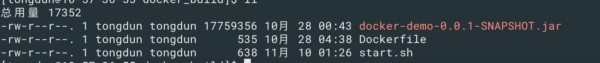
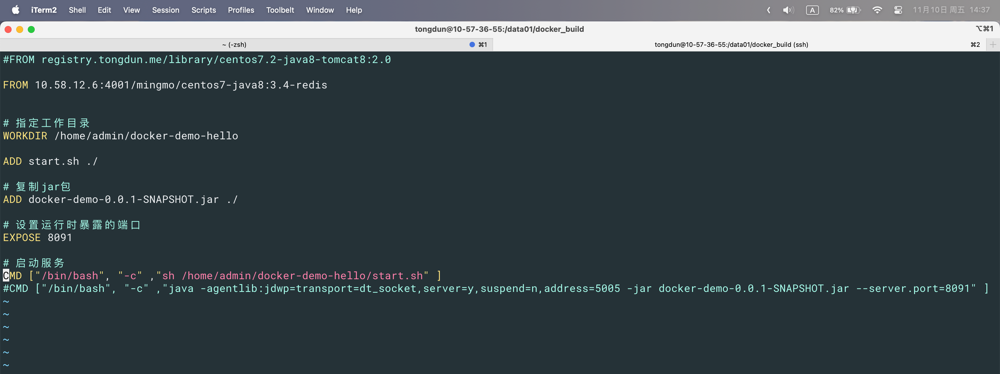

## 服务启动

### configurable-http-proxy

```shell
sudo docker service create --replicas 1 --name sd_config-http-proxy \
	--env CONFIGURABLE_PROXY_REDIS_URI=redis://:12345@10.57.34.196:6379 \
	-p 8044:8044 -p 8088:8088 \
	10.57.17.244:5000/ml/configurable-http-proxy:1.0.0
```

### 启动holems-python

```shell
sudo docker service create --name service-holmes-python --replicas 2 \
  -e redis_url=redis://10.58.12.9:32560 -p 9003:9003 \
  --mount type=bind,source=/data01/nfs/holmes/model,target=/home/admin/model \
  --mount type=bind,source=/data01/nfs/holmes/task,target=/home/admin/task \
  10.57.17.244:5000/cd/holmes-python-qiye:feature-2-5-4-2324
```

### gitlab

```shell
sudo docker run -d -p 51013:80 -v /data01/td/infra/gitlab:/var/lib/gitlab --privileged=true --name gitlab -e "GITLAB_OMNIBUS_CONFIG=gitlab_rails['time_zone'] = 'Asia/Shanghai'
external_url 'http://10.57.17.244'
gitlab_rails['manage_backup_path'] = true
gitlab_rails['backup_path'] = '/var/opt/gitlab-backup'
gitlab_rails['backup_keep_time'] = 604800
prometheus['enable'] = false" -e "GITLAB_HOST=http://10.57.17.244" -e "GITLAB_ROOT_PASSWORD=12345678" -e "GITLAB_ROOT_EMAIL=qiaoshi.wang@tongdun.cn" -e "GITLAB_BACKUP_SCHEDULE=daily" -e "GITLAB_BACKUP_TIME=23:30" 10.57.17.244:5000/library/enki-turing-gitlab-ce:2.0.0
```


## 信息查询

### 1. 当前运行的服务

```shell
docker service ls

## 停止服务
docker service rm ${serviceId}
```


### 2. 服务日志查询

```shell
docker service logs ${serviceId}

## 刷新
docker service logs -f ${serviceId}
```

### 3. 查询服务信息

```shell
sudo docker service inspect  ${serviceId}
# 只查询容器内ip
sudo docker service inspect -f '{{range .Endpoint.VirtualIPs}}{{.Addr}}{{end}}' e72e09c4cba3

docker inspect -f '{{.HostConfig.NetworkMode}}' e72e09c4cba3


```

### 4. 查看网络格式

```shell
sudo docker network ls

sudo docker network inspect {network_name}
```

### 5. 查看容器的worknetid

```shell
docker inspect -f '{{.NetworkSettings.Networks.<network_name>.NetworkID}}' 6701720d2dff
```

### 6. 进入容器

```shell
 sudo docker exec -it 4f96b75893f6 /bin/bash
 sudo docker exec -it 4f96b75893f6 sh
 
```

# 构建镜像





```shell
sudo docker build -t hello:1.0 -f ./Dockerfile .
```

# 启动镜像

```shell
sudo docker run -p {主机端口}:{容器端口} hello:1.0

sudo docker run -p 8091:8091 hello:1.0
```

## 查看service所在的容器

```shell
sudo docker service ps 28rn832o0xrf
```

