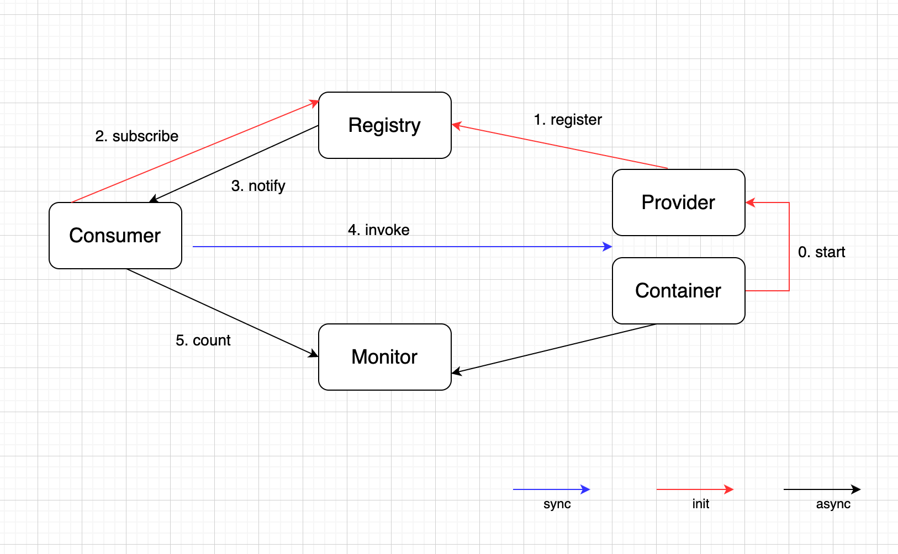

## dubbo架构图

* **Registry**: **注册中心**，负责服务地址的主持与查找。注册中心通过长连接感知Provider的存在，在Provider出现宕机时注册中心会立即推送相关事件通知Consumer。
* **Provider: 服务提供者**，在启动时，向注册中心进行注册操作，将自己服务的地址和相关配置信息封装成URL 添加到 ZooKeeper中。
* **Consumer: 服务消费者**，在启动时，向注册中心订阅其所需的服务。 
  * 从 ZooKeeper 中获取 Provider 注册的 URL，并在 ZooKeeper 中添加相应的**监听器**。
  * 获取到 Provider URL 之后，通过负载均衡算法，从多个 Provider中选择一个 Provider 建立连接，最后发起对 Provider 的 RPC 调用。
  * 如果 Provider URL 发生变更，Consumer 之前向注册中心添加到监听器会获取到最新的 Provider URL 信息。
  * **Consumer 与 Provider 建立的是长连接，且 Consumer 会缓存Provider 信息，所以一旦连接建立，即使注册中心宕机，也不会影响已运行的 Provider 与 Consumer**
* **Monitor: 监控中心**，用于统计和监控服务的调用次数和调用时间，以便对服务进行监控，并在出现问题时，能及时地采取措施。
  * Provider 和 Consumer 在运行过程中，会在内存中统计调用次数和调用时间，定时每分钟发送一次统计数据到监控中心
  * 监控中心是非必要的，即使监控中心宕机，也不会影响 Provider, Consumer, Registry 的运行。
* **Container: 服务运行容器**，是 Dubbo 的核心，它是Invoker的容器，维护着Invoker的生命周期，并负责Invoker的生命周期管理，Invoker的调用以及结果的返回。
