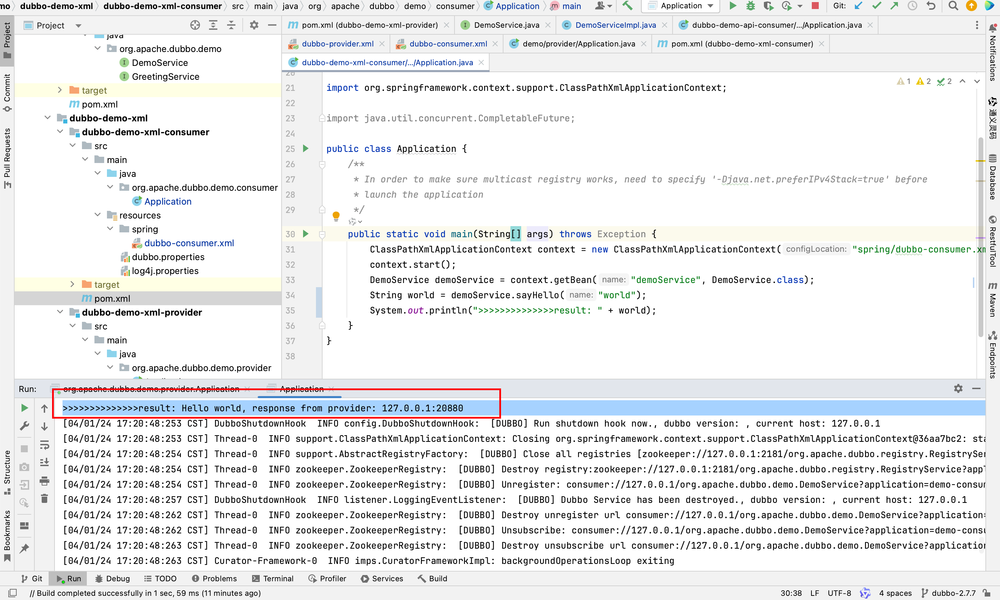
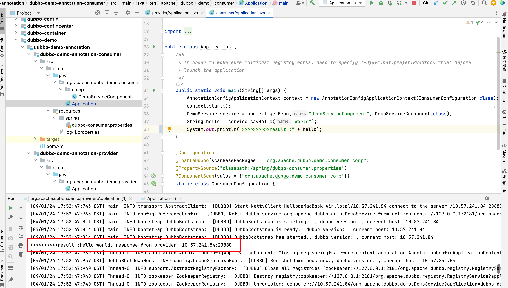

## 一. 准备注册中心
1. dubbo的注册中心在生产环境中，一般都会选择 ZooKeeper
   下载 ZooKeeper [ZooKeeper_3.4.14下载地址](https://archive.apache.org/dist/zookeeper/zookeeper-3.4.14/)
2. 启动ZK
```shell
# 解压安装包
tar -zxvf zookeeper-3.4.14.tar.gz

# 进入安装目录，
cp conf/zoo_sample.cfg conf/zoo.cfg

# 启动ZK
./bin/zkServer.sh start
```

## 二. 根据 xml 配置
### 1. Provider 准备
#### 一. 引入依赖
```xml
        <!-- 引入公共接口 -->
        <dependency>
            <groupId>org.apache.dubbo</groupId>
            <artifactId>dubbo-demo-interface</artifactId>
            <version>${project.parent.version}</version>
        </dependency>

        <dependency>
            <groupId>org.apache.dubbo</groupId>
            <artifactId>dubbo-registry-multicast</artifactId>
        </dependency>
        <dependency>
            <groupId>org.apache.dubbo</groupId>
            <artifactId>dubbo-registry-nacos</artifactId>
        </dependency>
        <dependency>
            <groupId>com.alibaba.nacos</groupId>
            <artifactId>nacos-client</artifactId>
        </dependency>
        <dependency>
            <groupId>org.apache.dubbo</groupId>
            <artifactId>dubbo-registry-zookeeper</artifactId>
        </dependency>
        <dependency>
            <groupId>org.apache.dubbo</groupId>
            <artifactId>dubbo-configcenter-zookeeper</artifactId>
        </dependency>
        <dependency>
            <groupId>org.apache.dubbo</groupId>
            <artifactId>dubbo-configcenter-nacos</artifactId>
        </dependency>
        <dependency>
            <groupId>org.apache.dubbo</groupId>
            <artifactId>dubbo-metadata-report-nacos</artifactId>
        </dependency>
        <dependency>
            <groupId>org.apache.dubbo</groupId>
            <artifactId>dubbo-metadata-report-zookeeper</artifactId>
        </dependency>
        <dependency>
            <groupId>org.apache.dubbo</groupId>
            <artifactId>dubbo-rpc-dubbo</artifactId>
        </dependency>
        <dependency>
            <groupId>org.apache.dubbo</groupId>
            <artifactId>dubbo-config-spring</artifactId>
        </dependency>
        <dependency>
            <groupId>org.apache.dubbo</groupId>
            <artifactId>dubbo-remoting-netty4</artifactId>
        </dependency>
        <dependency>
            <groupId>org.apache.dubbo</groupId>
            <artifactId>dubbo-serialization-hessian2</artifactId>
        </dependency>
        <dependency>
            <groupId>org.apache.dubbo</groupId>
            <artifactId>dubbo-qos</artifactId>
        </dependency>
```
#### 二. 服务接口
这个接口需要被 Provider 中的服务具体实现，同时也能被 Consumer 引用，所有可以考虑将所有 dubbo中的接口封装在一个二方包中，这样 Provider， Consumer 引入同一个包即可。
```java
package org.apache.dubbo.demo;

import java.util.concurrent.CompletableFuture;

public interface DemoService {

    String sayHello(String name);

    default CompletableFuture<String> sayHelloAsync(String name) {
        return CompletableFuture.completedFuture(sayHello(name));
    }

}
```

#### 三. 编写service
```java
package org.apache.dubbo.demo.provider;

import org.apache.dubbo.demo.DemoService;
import org.apache.dubbo.rpc.RpcContext;

import org.slf4j.Logger;
import org.slf4j.LoggerFactory;

import java.util.concurrent.CompletableFuture;

public class DemoServiceImpl implements DemoService {
   private static final Logger logger = LoggerFactory.getLogger(DemoServiceImpl.class);

   @Override
   public String sayHello(String name) {
      logger.info("Hello " + name + ", request from consumer: " + RpcContext.getContext().getRemoteAddress());
      try {
         Thread.sleep(1000);
      } catch (InterruptedException e) {
         e.printStackTrace();
      }
      return "Hello " + name + ", response from provider: " + RpcContext.getContext().getLocalAddress();
   }

   @Override
   public CompletableFuture<String> sayHelloAsync(String name) {
      return CompletableFuture.supplyAsync(() -> "async result");
   }
}
```

#### 四. 在xml中配置 service
```xml
<?xml version="1.0" encoding="UTF-8"?>
<beans xmlns:xsi="http://www.w3.org/2001/XMLSchema-instance"
       xmlns:dubbo="http://dubbo.apache.org/schema/dubbo"
       xmlns="http://www.springframework.org/schema/beans"
       xsi:schemaLocation="http://www.springframework.org/schema/beans http://www.springframework.org/schema/beans/spring-beans-4.3.xsd
       http://dubbo.apache.org/schema/dubbo http://dubbo.apache.org/schema/dubbo/dubbo.xsd">

    <dubbo:application metadata-type="remote" name="demo-provider"/>
    <dubbo:metadata-report address="zookeeper://127.0.0.1:2181"/>

    <dubbo:registry address="zookeeper://127.0.0.1:2181"/>

    <dubbo:protocol name="dubbo"/>

    <bean id="demoService" class="org.apache.dubbo.demo.provider.DemoServiceImpl"/>

    <dubbo:service interface="org.apache.dubbo.demo.DemoService" ref="demoService"/>

</beans>
```
#### 五. 启动 Provider
```java
package org.apache.dubbo.demo.provider;

import org.springframework.context.support.ClassPathXmlApplicationContext;

public class Application {
    public static void main(String[] args) throws Exception {
        ClassPathXmlApplicationContext context = new ClassPathXmlApplicationContext("spring/dubbo-provider.xml");
        context.start();
        System.in.read();
    }
}
```

### 2. Consumer 准备
#### 一. 引入依赖
```xml
        <dependency>
            <groupId>org.apache.dubbo</groupId>
            <artifactId>dubbo-metadata-report-zookeeper</artifactId>
        </dependency>
        <dependency>
            <groupId>org.apache.dubbo</groupId>
            <artifactId>dubbo-demo-interface</artifactId>
            <version>${project.parent.version}</version>
        </dependency>
        <dependency>
            <groupId>org.apache.dubbo</groupId>
            <artifactId>dubbo-registry-multicast</artifactId>
        </dependency>
        <dependency>
            <groupId>org.apache.dubbo</groupId>
            <artifactId>dubbo-registry-nacos</artifactId>
        </dependency>
        <dependency>
            <groupId>com.alibaba.nacos</groupId>
            <artifactId>nacos-client</artifactId>
        </dependency>
        <dependency>
            <groupId>org.apache.dubbo</groupId>
            <artifactId>dubbo-registry-zookeeper</artifactId>
        </dependency>
        <dependency>
            <groupId>org.apache.dubbo</groupId>
            <artifactId>dubbo-configcenter-zookeeper</artifactId>
        </dependency>
        <dependency>
            <groupId>org.apache.dubbo</groupId>
            <artifactId>dubbo-configcenter-nacos</artifactId>
        </dependency>
        <dependency>
            <groupId>org.apache.dubbo</groupId>
            <artifactId>dubbo-metadata-report-nacos</artifactId>
        </dependency>
        <dependency>
            <groupId>org.apache.dubbo</groupId>
            <artifactId>dubbo-config-spring</artifactId>
        </dependency>
        <dependency>
            <groupId>org.apache.dubbo</groupId>
            <artifactId>dubbo-rpc-dubbo</artifactId>
        </dependency>
        <dependency>
            <groupId>org.apache.dubbo</groupId>
            <artifactId>dubbo-remoting-netty4</artifactId>
        </dependency>
        <dependency>
            <groupId>org.apache.dubbo</groupId>
            <artifactId>dubbo-serialization-hessian2</artifactId>
        </dependency>
```
#### 二. 在xml中配置 service
因为已经引入了 interface 包
可以直接配置：
```xml
<?xml version="1.0" encoding="UTF-8"?>
<beans xmlns:xsi="http://www.w3.org/2001/XMLSchema-instance"
       xmlns:dubbo="http://dubbo.apache.org/schema/dubbo"
       xmlns="http://www.springframework.org/schema/beans"
       xsi:schemaLocation="http://www.springframework.org/schema/beans http://www.springframework.org/schema/beans/spring-beans-4.3.xsd
       http://dubbo.apache.org/schema/dubbo http://dubbo.apache.org/schema/dubbo/dubbo.xsd">

    <dubbo:application name="demo-consumer"/>

    <dubbo:registry address="zookeeper://127.0.0.1:2181"/>

    <dubbo:reference id="demoService" check="false" interface="org.apache.dubbo.demo.DemoService"/>

</beans>

```
#### 三. 启动 Consumer
```java
package org.apache.dubbo.demo.consumer;

import org.apache.dubbo.demo.DemoService;

import org.springframework.context.support.ClassPathXmlApplicationContext;

import java.util.concurrent.CompletableFuture;

public class Application {
    /**
     * In order to make sure multicast registry works, need to specify '-Djava.net.preferIPv4Stack=true' before
     * launch the application
     */
    public static void main(String[] args) throws Exception {
        ClassPathXmlApplicationContext context = new ClassPathXmlApplicationContext("spring/dubbo-consumer.xml");
        context.start();
        DemoService demoService = context.getBean("demoService", DemoService.class);
        String world = demoService.sayHello("world");
        System.out.println(">>>>>>>>>>>>>>result: " + world);
    }
}
```

**结果：**



## 三. 基于注解配置

依赖引入同上，或者参考[官方文档](https://github.com/HelloWorldDoNotLaugh/dubbo/tree/dubbo-2.7.7?tab=readme-ov-file)

### 1. Provider 准备

#### 一. 实现接口

```java
package org.apache.dubbo.demo.provider;

import org.apache.dubbo.config.annotation.Service;
import org.apache.dubbo.demo.DemoService;
import org.apache.dubbo.rpc.RpcContext;

import org.slf4j.Logger;
import org.slf4j.LoggerFactory;

import java.util.concurrent.CompletableFuture;

@Service
public class DemoServiceImpl implements DemoService {
    private static final Logger logger = LoggerFactory.getLogger(DemoServiceImpl.class);

    @Override
    public String sayHello(String name) {
        logger.info("Hello " + name + ", request from consumer: " + RpcContext.getContext().getRemoteAddress());
        return "Hello " + name + ", response from provider: " + RpcContext.getContext().getLocalAddress();
    }

    @Override
    public CompletableFuture<String> sayHelloAsync(String name) {
        return null;
    }

}
```

#### 二. 通过注解实现配置

```java
@Configuration
@EnableDubbo(scanBasePackages = "org.apache.dubbo.demo.provider")
@PropertySource("classpath:/spring/dubbo-provider.properties")
static class ProviderConfiguration {
    @Bean
    public RegistryConfig registryConfig() {
        RegistryConfig registryConfig = new RegistryConfig();
        registryConfig.setAddress("zookeeper://127.0.0.1:2181");
        return registryConfig;
    }
}
```

**classpath:/spring/dubbo-provider.properties文件** 

```properties
dubbo.application.name=dubbo-demo-annotation-provider
dubbo.protocol.name=dubbo
dubbo.protocol.port=20880
```

### 2. Consumer 准备

#### 一. 创建接口

```java
package org.apache.dubbo.demo.consumer.comp;

import org.apache.dubbo.config.annotation.Reference;
import org.apache.dubbo.demo.DemoService;

import org.springframework.stereotype.Component;

import java.util.concurrent.CompletableFuture;

@Component("demoServiceComponent")
public class DemoServiceComponent implements DemoService {
    @Reference
    private DemoService demoService;

    @Override
    public String sayHello(String name) {
        return demoService.sayHello(name);
    }

    @Override
    public CompletableFuture<String> sayHelloAsync(String name) {
        return null;
    }
}
```

#### 二. 通过注解添加配置

```java

    @Configuration
    @EnableDubbo(scanBasePackages = "org.apache.dubbo.demo.consumer.comp")
    @PropertySource("classpath:/spring/dubbo-consumer.properties")
    @ComponentScan(value = {"org.apache.dubbo.demo.consumer.comp"})
    static class ConsumerConfiguration {

    }
```

**spring/dubbo-consumer.properties**

```properties
dubbo.application.name=dubbo-demo-annotation-consumer
dubbo.registry.address=zookeeper://127.0.0.1:2181
```

**消费结果**



## 四. 基于API的配置

不依赖于 spring框架。详情见[dubbo-demo-api](https://github.com/apache/dubbo/tree/dubbo-2.7.7/dubbo-demo/dubbo-demo-api)
