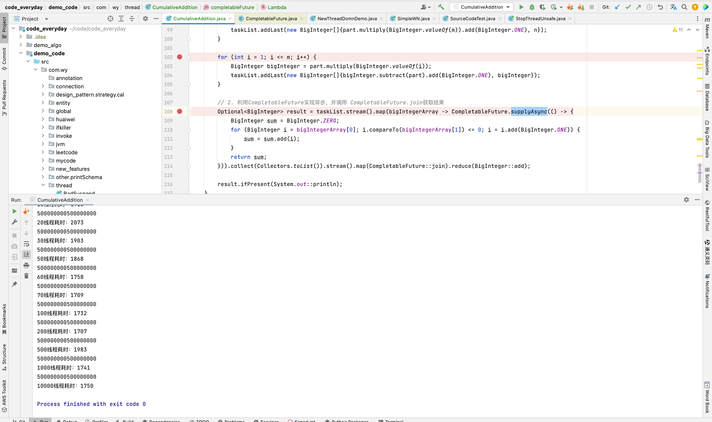

## 不优雅的地方

1. 对线程结果的获取
2. 需要额外引入CountDownLatch等待所有线程执行完毕


## CompletableFuture 

Future接口天然可以通过回调获取结果，所以可以利用**CompletableFuture**实现并行，并调用**CompletableFuture.join**获取结果

```java
private static void completableFuture(BigInteger n, int m) {
        //1. 还是先将任务拆分，一定要考虑除不尽的情况
        BigInteger part = n.divide(BigInteger.valueOf(m));
        LinkedList<BigInteger[]> taskList = new LinkedList<>();
        if (part.multiply(BigInteger.valueOf(m)).compareTo(n) != 0) {
            taskList.addLast(new BigInteger[]{part.multiply(BigInteger.valueOf(m)).add(BigInteger.ONE), n});
        }

        for (int i = 1; i <= m; i++) {
            BigInteger bigInteger = part.multiply(BigInteger.valueOf(i));
            taskList.addLast(new BigInteger[]{bigInteger.subtract(part).add(BigInteger.ONE), bigInteger});
        }

        // 2. 利用CompletableFuture实现并行，并调用 CompletableFuture.join获取结果
        Optional<BigInteger> result = taskList.stream().map(bigIntegerArray -> CompletableFuture.supplyAsync(() -> {
            BigInteger sum = BigInteger.ZERO;
            for (BigInteger i = bigIntegerArray[0]; i.compareTo(bigIntegerArray[1]) <= 0; i = i.add(BigInteger.ONE)) {
                sum = sum.add(i);
            }
            return sum;
        })).collect(Collectors.toList()).stream().map(CompletableFuture::join).reduce(BigInteger::add);

        result.ifPresent(System.out::println);
    }
```



