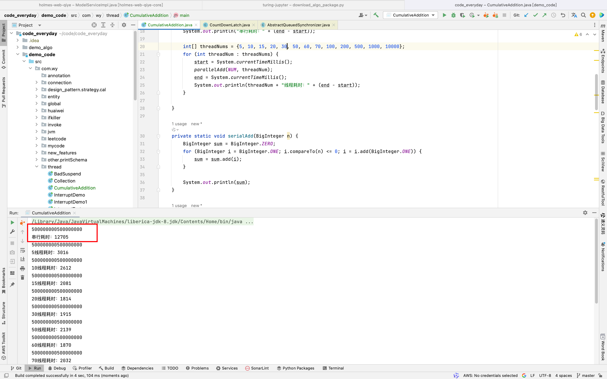
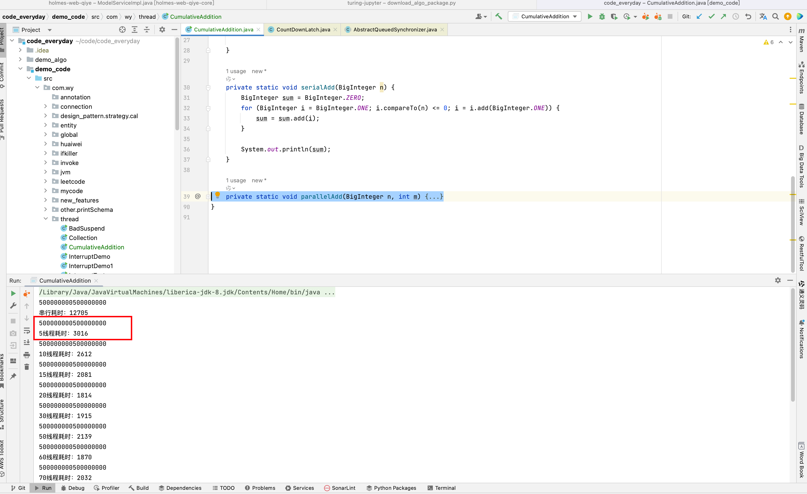
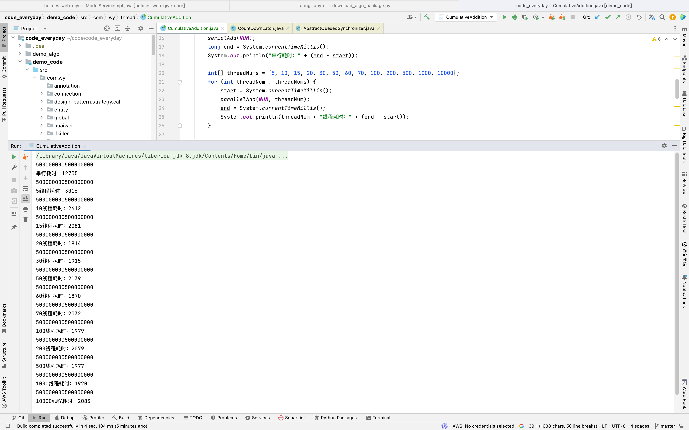

## 串行：1 + 到 1_000_000_000

耗时大概 15s 结果：499999999500000000

```java
 private static void serialAdd(BigInteger n) {
        BigInteger sum = BigInteger.ZERO;
        for (BigInteger i = BigInteger.ONE; i.compareTo(n) <= 0; i = i.add(BigInteger.ONE)) {
            sum = sum.add(i);
        }

        System.out.println(sum);
 }
```



## 并行

5线程耗时大概 3s

```java
    private static void parallelAdd(BigInteger n, int m) {
        /* 起m个线程并行计算*/

        // 1. 先分割,将n分成m份 4, 8, 12 16 20
        BigInteger[][] tasks;
        BigInteger part = n.divide(BigInteger.valueOf(m));

        BigInteger partSum = part.multiply(BigInteger.valueOf(m));
        if (partSum.compareTo(n) != 0) {
            tasks = new BigInteger[m + 1][2];
            tasks[m][0] = partSum.add(BigInteger.ONE);
            tasks[m][1] = n;
        } else {
            tasks = new BigInteger[m][2];
        }

        for (int i = 1; i <= m; i++) {
            tasks[i-1][1] = part.multiply(BigInteger.valueOf(i));
            tasks[i-1][0] = tasks[i-1][1].subtract(part).add(BigInteger.ONE);
        }

        m = tasks.length;

        // 2. 启动m个线程，执行计算
        BigInteger[] results = new BigInteger[m];
        CountDownLatch countDownLatch = new CountDownLatch(m);
        for (int i = 0; i < m; i++) {
            int finalI = i;
            new Thread(() -> {
                BigInteger sum = BigInteger.ZERO;
                for (BigInteger j = tasks[finalI][0]; j.compareTo(tasks[finalI][1]) <= 0; j = j.add(BigInteger.ONE)) {
                    sum = sum.add(j);
                }
                results[finalI] = sum;
                countDownLatch.countDown();
            }).start();
        }

        try {
            countDownLatch.await();
        } catch (InterruptedException e) {
            throw new RuntimeException(e);
        }

        BigInteger sum = BigInteger.ZERO;
        for (BigInteger result : results) {
            sum = sum.add(result);
        }

        System.out.println(sum);
    }
```



## 线程越多越快吗？

```java
  public static void main(String[] args) {
        int[] threadNums = {5, 10, 15, 20, 30, 50};
        for (int threadNum : threadNums) {
            long start = System.currentTimeMillis();
            parallelAdd(NUM, threadNum);
            long end = System.currentTimeMillis();
            System.out.println(threadNum + "线程耗时：" + (end - start));
        }

  }
```



| 5线程 | 10线程 | 15线程 | 20线程 | 30线程 | 50线程 | 100线程 | 500线程 | 1000线程 | 10000线程 |
| ----- | ------ | ------ | ------ | ------ | ------ | ------- | ------- | -------- | --------- |
| 3016  | 2612   | 2081   | 1814   | 1915   | 2139   | 1979    | 1977    | 1920     | 2083      |

### 结论

显然不是，当线程数过多时，上下文切换也会增加耗时