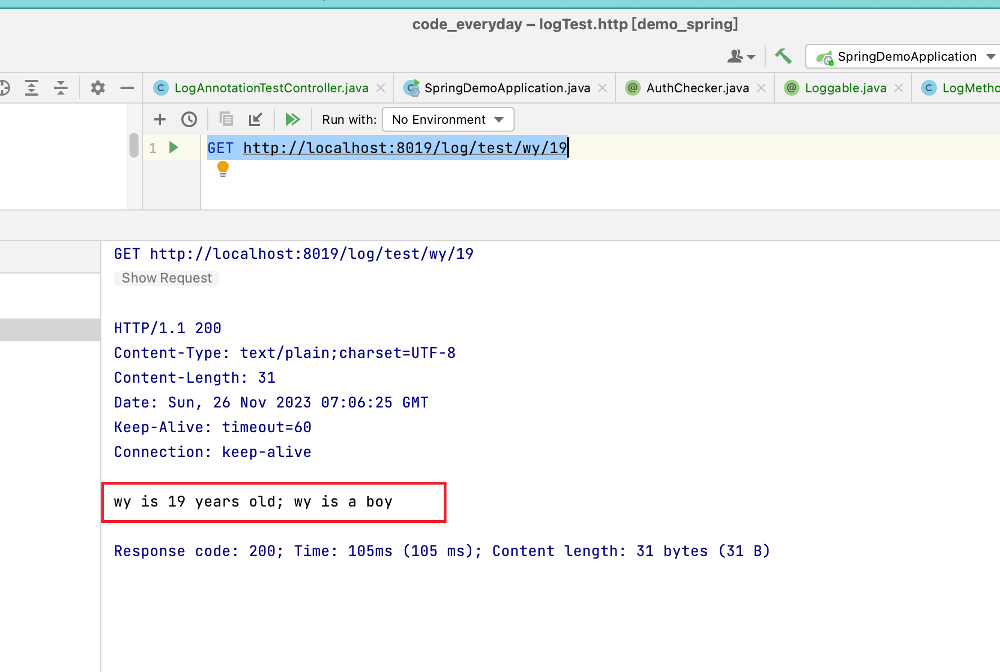
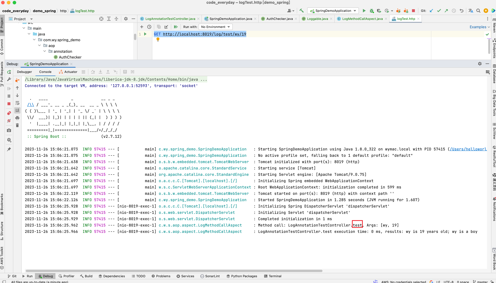
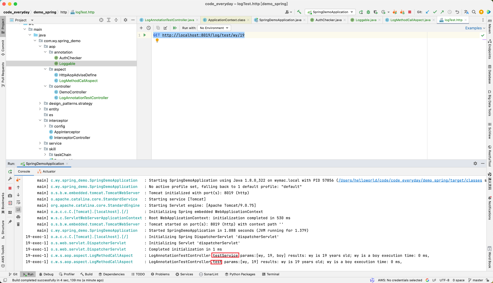
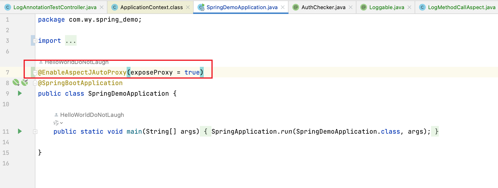

## AOP + 自定义注解实现日志打印 
### 1. 先定义个注解，让它作用于方法上
```java
@Target({ElementType.METHOD})
@Retention(RetentionPolicy.RUNTIME)
public @interface Loggable {

}
```

### 2. 定义切面
```java
@Aspect
@Component
@Slf4j
public class LogMethodCallAspect {

    @Pointcut("@annotation(com.wy.spring_demo.aop.annotation.Loggable)")
    public void logMethodCall() {}
    
    @AfterReturning(pointcut = "logMethodCall()", returning = "result")
    public void logMethodCallAfterReturning(JoinPoint joinPoint, Object result) {
        long startTime = System.currentTimeMillis();
        long executionTime = System.currentTimeMillis() - startTime;

        String className = joinPoint.getTarget().getClass().getSimpleName();
        String methodName = joinPoint.getSignature().getName();

        log.info("{}.{} params:{} results: {} execution time: {} ms,",
                className,
                methodName,
                joinPoint.getArgs(),
                result,
                executionTime);
    }

}

```

看上去似乎简简单单，感觉只需要在要打印的方法上加上注解就ok了。
所以简单定义一个controller测试一下

```java
@RestController
@RequestMapping("/log")
public class LogAnnotationTestController {
    @Resource
    LogAnnotationTestController thisController;

    @Loggable
    @GetMapping("/test/{name}/{age}")
    public String test(@PathVariable("name") String name, @PathVariable("age") int age) {
        return thisController.testService(name, age, "boy");
    }


    @Loggable
    public String testService(String name, int age, String sex) {
        return String.format("%s is %s years old; wy is a %s", name, age, sex);
    }
}
```
再整个http发请求
```http request
GET http://localhost:8019/log/test/wy/19
```

小小测试一下，发送请求：



请求成功被响应，检查一下日志：



### 3. 注解失效情况及解决方案

🤔很奇怪，怎么有个注解没生效。。。什么情况，回顾下调用链路：test -> testService，testService上的注解没生效。。。

感觉似曾相识，怎么自定义的注解跟 @Transactional 一样，也会出现失效，于是网上查了一下

> 在Spring AOP中，如果在同一个类中的方法内部调用另一个方法，AOP切面有时可能无法拦截到被调用的方法，导致B方法上的注解失效。这是因为Spring AOP是基于代理的，而对于内部调用，代理对象内部的方法调用是不会触发切面的。

那么解决方案也有好几种：

1. 通过**ApplicationContext**获取Bean，这样就能保证调用的是讲过sping代理的bean

	```java
	 @Resource
	    private ApplicationContext applicationContext;
	    @Loggable
	    @GetMapping("/test/{name}/{age}")
	    public String test(@PathVariable("name") String name, @PathVariable("age") int age) {
	        LogAnnotationTestController contextBean = applicationContext.getBean(LogAnnotationTestController.class);
	        return contextBean.testService(name, age, "boy");
	    }
	
	
	    @Loggable
	    public String testService(String name, int age, String sex) {
	        return String.format("%s is %s years old; wy is a %s", name, age, sex);
	    }
	```



2. **通过AopContext.currentProxy()获取代理对象进行调用**

	需要先开启 @EnableAspectJAutoProxy(exposeProxy = true) 

	在启动类上添加配置

	

```java
 @Loggable
    @GetMapping("/test/{name}/{age}")
    public String test(@PathVariable("name") String name, @PathVariable("age") int age) {
        LogAnnotationTestController logAnnotationTestController = (LogAnnotationTestController) AopContext.currentProxy();
        return logAnnotationTestController.testService(name, age, "boy");
    }


    @Loggable
    public String testService(String name, int age, String sex) {
        return String.format("%s is %s years old; wy is a %s", name, age, sex);
    }
```


