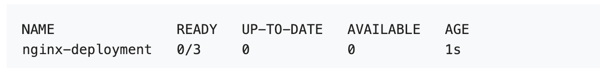

# PeplicaSet

ReplicaSet 的目的是维护一组在任何时候都处于运行状态的 Pod 副本的稳定集合，通常用来保证给定数量的、完全相同的 Pod 的可用性。

## 最佳实践

[`Deployment`](https://kubernetes.io/zh-cn/docs/concepts/workloads/controllers/deployment/) 是一个可以拥有 ReplicaSet 并使用声明式方式在服务器端完成对 Pod 滚动更新的对象。 尽管 ReplicaSet 可以独立使用，目前它们的主要用途是提供给 Deployment 作为编排 Pod 创建、删除和更新的一种机制。当使用 Deployment 时，你不必关心如何管理它所创建的 ReplicaSet，Deployment 拥有并管理其 ReplicaSet。 因此，建议你在需要 ReplicaSet 时使用 Deployment。

# Deployment

**作用**：  Deployment 为 [Pod](https://kubernetes.io/zh-cn/docs/concepts/workloads/pods/) 和 [ReplicaSet](https://kubernetes.io/zh-cn/docs/concepts/workloads/controllers/replicaset/) 提供声明式的更新能力。

## 使用

负责启动3个nginx Pod的 Deployment用例

**nginx-deployment.yaml**

```yaml
apiVersion: apps/v1
kind: Deployment
metadata:
  name: nginx-deployment
  labels:
    app: nginx
spec:
  replicas: 3
  selector:
    matchLabels:
      app: nginx
  template:
    metadata:
      labels:
        app: nginx
    spec:
      containers:
      - name: nginx
        image: nginx:1.14.2
        ports:
        - containerPort: 80

```

1. 创建deployment

	```bash
	kubectl apply -f ./nginx-deployment.yaml
	```

2. 查看状态

	```bash
	kubectl get deployments |grep nginx-deployment
	```

	

参数说明：

- `NAME` 列出了名字空间中 Deployment 的名称。
- `READY` 显示应用程序的可用的“副本”数。显示的模式是“就绪个数/期望个数”。
- `UP-TO-DATE` 显示为了达到期望状态已经更新的副本数。
- `AVAILABLE` 显示应用可供用户使用的副本数。
- `AGE` 显示应用程序运行的时间。

3. 查看deployment的上线状态

	```bash
	kubectl rollout status deployment/nginx-deployment
	```

4. 查看Deployment创建的ReplicaSet

	```bash
	kubectl get rs
	```

5. 查看创建的pod

	```bash
	kubectl get pods
	```

6. 查看deployment启动日志，pod启动日志

	```bash
	kubectl describe deployment <deployment-name>
	kubectl describe pod <pod-name>
	```
	

## 更新与回滚Deployment

1. 修改镜像版本

	```bash
	kubectl set image deployment/nginx-deployment nginx=nginx:1.161
	```

2. 检查Deployment 上线历史

	```bash
	kubectl rollout history deployment/nginx-deployment
	```

	输出类似于

	```tex
	deployments "nginx-deployment"
	REVISION    CHANGE-CAUSE
	1           kubectl apply --filename=https://k8s.io/examples/controllers/nginx-deployment.yaml
	2           kubectl set image deployment/nginx-deployment nginx=nginx:1.16.1
	3           kubectl set image deployment/nginx-deployment nginx=nginx:1.161
	```

`CHANGE-CAUSE` 的内容是从 Deployment 的 `kubernetes.io/change-cause` 注解复制过来的。 复制动作发生在修订版本创建时。你可以通过以下方式设置 `CHANGE-CAUSE` 消息：

- 使用 `kubectl annotate deployment/nginx-deployment kubernetes.io/change-cause="image updated to 1.16.1"` 为 Deployment 添加注解。
- 手动编辑资源的清单。

3. 要查看修订历史的详细信息

	```bash
	kubectl rollout history deployment/nginx-deployment --revision=2
	```

4. 回滚到上一个修改的版本

	```bash
	kubectl rollout undo deployment/nginx-deployment
	```

5. 回滚到指定版本

	```bash
	kubectl rollout undo deployment/nginx-deployment --to-revision=2
	```

	

## 缩放Deployment

1. 缩放指定大小

	```bash
	kubectl scale deployment/nginx-deployment --replicas=10
	```

2. 自动缩放

	```bash
	kubectl autoscale deployment/nginx-deployment --min=10 --max=15 --cpu-percent=80
	```

	 Deployment 设置自动缩放器，并基于现有 Pod 的 CPU 利用率选择要运行的 Pod 个数下限和上限。

## 暂定运行中的deployment

```bash
kubectl rollout pause deployment/nginx-deployment
```

此时可以更新deployment

恢复deployment

```bash
kubectl rollout resume deployment/nginx-deployment
```

**不可以回滚处于暂停状态的 Deployment，除非先恢复其执行状态** 

## deployment的状态

* Progressing(进行中)
* Complete(已完成)
* Failed(失败)

### 进行中的Deployment

执行下面的任务期间，Kubernetes 标记 Deployment 为**进行中**（Progressing）：

- Deployment 创建新的 ReplicaSet
- Deployment 正在为其最新的 ReplicaSet 扩容
- Deployment 正在为其旧有的 ReplicaSet(s) 缩容
- 新的 Pod 已经就绪或者可用（就绪至少持续了MinReadySeconds 秒）。

当上线过程进入“Progressing”状态时，Deployment 控制器会向 Deployment 的 `.status.conditions` 中添加包含下面属性的状况条目：

- `type: Progressing`
- `status: "True"`
- `reason: NewReplicaSetCreated` | `reason: FoundNewReplicaSet` | `reason: ReplicaSetUpdated`

可以使用 `kubectl rollout status` 监视 Deployment 的进度。

### 完成的 Deployment

当 Deployment 具有以下特征时，Kubernetes 将其标记为**完成（Complete）**;

- 与 Deployment 关联的所有副本都已更新到指定的最新版本，这意味着之前请求的所有更新都已完成。
- 与 Deployment 关联的所有副本都可用。
- 未运行 Deployment 的旧副本。

当上线过程进入“Complete”状态时，Deployment 控制器会向 Deployment 的 `.status.conditions` 中添加包含下面属性的状况条目：

- `type: Progressing`
- `status: "True"`
- `reason: NewReplicaSetAvailable`

这一 `Progressing` 状况的状态值会持续为 `"True"`，直至新的上线动作被触发。 即使副本的可用状态发生变化（进而影响 `Available` 状况），`Progressing` 状况的值也不会变化。

可以使用 `kubectl rollout status` 检查 Deployment 是否已完成。 如果上线成功完成，`kubectl rollout status` 返回退出代码 0。

### 失败的 Deployment

Deployment 可能会在尝试部署其最新的 ReplicaSet 受挫，一直处于未完成状态。 造成此情况一些可能因素如下：

- 配额（Quota）不足
- 就绪探测（Readiness Probe）失败
- 镜像拉取错误
- 权限不足
- 限制范围（Limit Ranges）问题
- 应用程序运行时的配置错误

检测此状况的一种方法是在 Deployment 规约中指定截止时间参数： （[`.spec.progressDeadlineSeconds`](https://kubernetes.io/zh-cn/docs/concepts/workloads/controllers/deployment/#progress-deadline-seconds)）。 `.spec.progressDeadlineSeconds` 给出的是一个秒数值，Deployment 控制器在（通过 Deployment 状态） 标示 Deployment 进展停滞之前，需要等待所给的时长。

以下 `kubectl` 命令设置规约中的 `progressDeadlineSeconds`，从而告知控制器 在 10 分钟后报告 Deployment 的上线没有进展：

```shell
kubectl patch deployment/nginx-deployment -p '{"spec":{"progressDeadlineSeconds":600}}'
```

输出类似于：

```
deployment.apps/nginx-deployment patched
```

超过截止时间后，Deployment 控制器将添加具有以下属性的 Deployment 状况到 Deployment 的 `.status.conditions` 中：

- `type: Progressing`
- `status: "False"`
- `reason: ProgressDeadlineExceeded`

这一状况也可能会比较早地失败，因而其状态值被设置为 `"False"`， 其原因为 `ReplicaSetCreateError`。 一旦 Deployment 上线完成，就不再考虑其期限。

## 清理策略

可以在 Deployment 中设置 `.spec.revisionHistoryLimit` 字段以指定保留此 Deployment 的多少个旧有 ReplicaSet。其余的 ReplicaSet 将在后台被垃圾回收。 默认情况下，此值为 10。

**说明：**

显式将此字段设置为 0 将导致 Deployment 的所有历史记录被清空，因此 Deployment 将无法回滚。