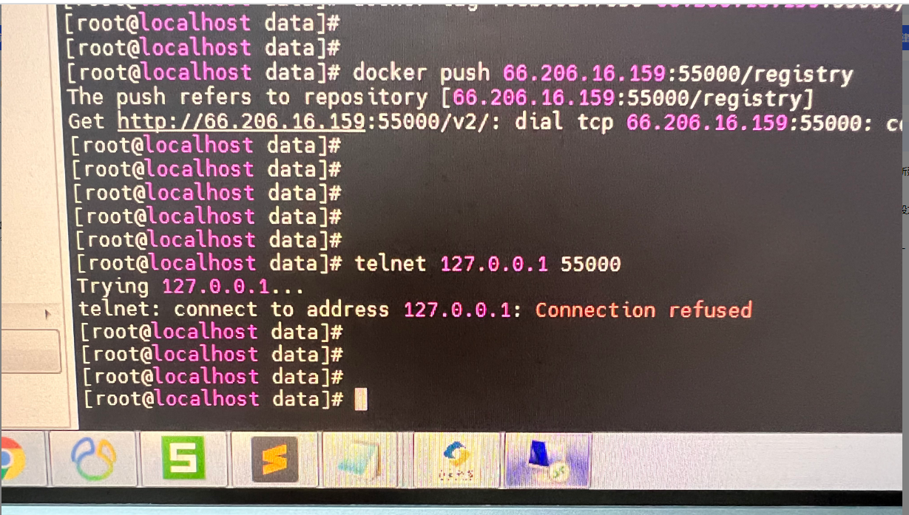
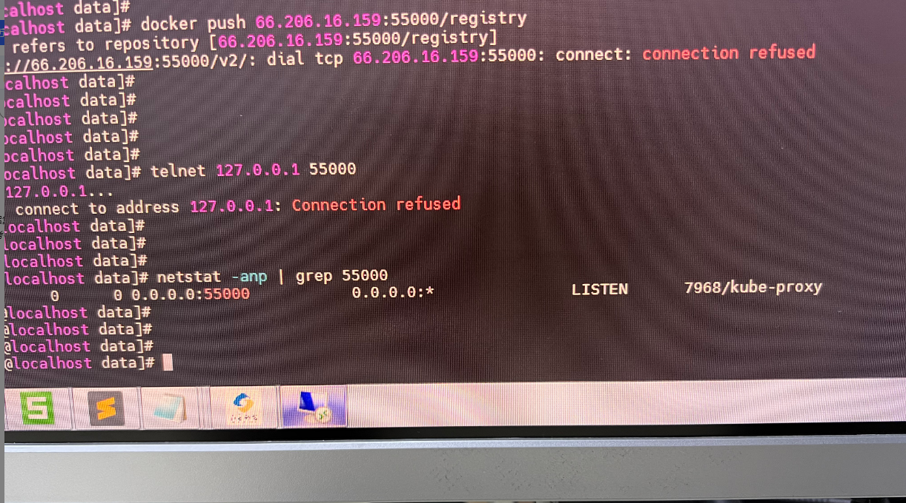
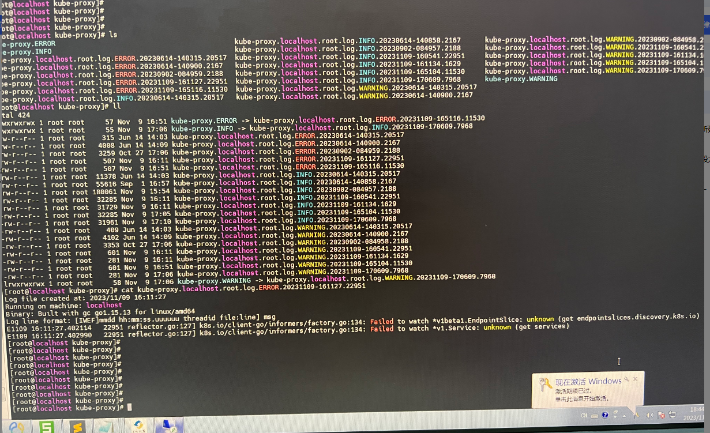
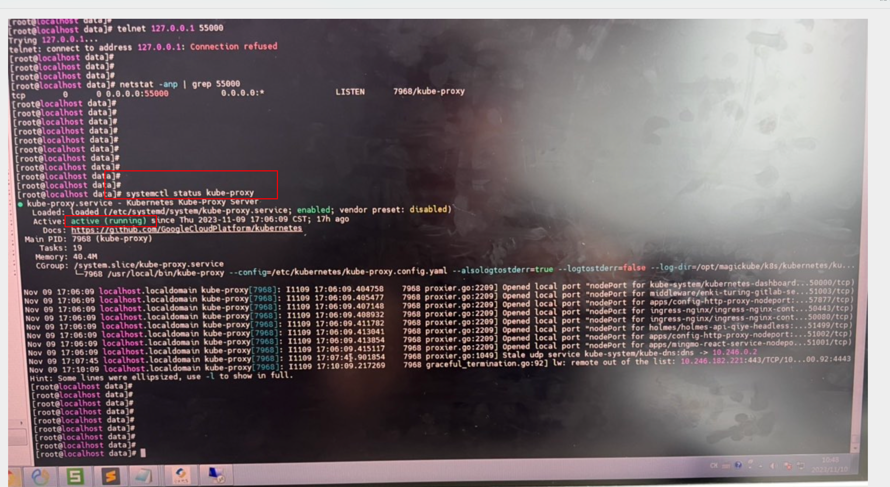
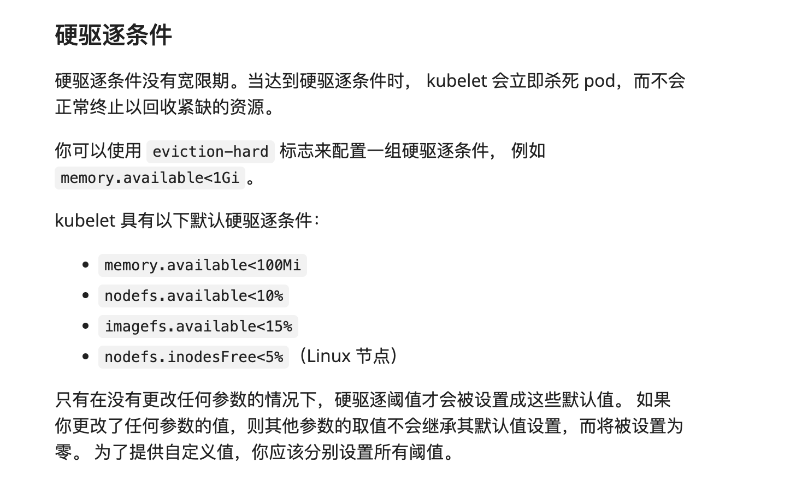

# k8s集群问题__docker push镜像报55000端口connection refused_解决方案

## 问题描述

K8s集群组件kube-proxy没有响应。重启集群的所有组件包括docker也解决不了。问题表现是docker push镜像报55000端口connection refused，但是查看服务是在的。详细请参考截图






把集群所有的k8s服务都重启过了，还是没有解决这个问题。kube-proxy的详细日志：



## 问题分析

```shell
# 查看kube-proxy状态
systemctl status kube-proxy
```

从 kube-proxy 状态看，kube-proxy服务是正常的



但是 telnet 127.0.0.1:55000 connection refused，猜测 55000服务没起成功

```shell
# 查询docker-registry服务信息
kubectl get svc -n kube-system -l app=docker-registry
# docker-registry 查看容器信息
kubectl get pod -n kube-system -l app=docker-registry -o wide
```


进一步确认是： 55000服务对应的容器没启动成功

猜测是因为磁盘空间不足或者磁盘挂载出现问题

df -h 查看磁盘挂载情况：


得出结论：**这个节点根盘写太满了，触发了kubelet的驱逐条件，导致节点不正常调度 dockerr egistry的容器起不来**

## 解决方案

清理磁盘空间，重装registry镜像

## kubelet硬驱逐条件

硬驱逐条件没有宽限期。当达到硬驱逐条件时， kubelet 会立即杀死 pod，而不会正常终止以回收紧缺的资源。

你可以使用 `eviction-hard` 标志来配置一组硬驱逐条件， 例如 `memory.available<1Gi`。

kubelet 具有以下默认硬驱逐条件：

- `memory.available<100Mi：如果节点上可用内存低于 100Mi，kubelet 将开始硬驱逐容器。`
- `nodefs.available<10%`：节点上的磁盘可用空间低于 10%
- `imagefs.available<15%`： 容器镜像文件系统的可用空间低于 15%
- `nodefs.inodesFree<5%`（Linux 节点）： 节点上的磁盘剩余 inode（用于跟踪文件和目录）的百分比低于 5%




## 参考文档

* [环境运行一段时间后，容器突然出现ImagePullBackOff ，如何解决](https://wiki.tongdun.me/pages/viewpage.action?pageId=48166142#id-5.X%E9%AD%94%E6%96%B9FAQ-%E7%8E%AF%E5%A2%83%E8%BF%90%E8%A1%8C%E4%B8%80%E6%AE%B5%E6%97%B6%E9%97%B4%E5%90%8E%EF%BC%8C%E5%AE%B9%E5%99%A8%E7%AA%81%E7%84%B6%E5%87%BA%E7%8E%B0ImagePullBackOff%EF%BC%8C%E5%A6%82%E4%BD%95%E8%A7%A3%E5%86%B3%EF%BC%9F)
* [kubectl客户端使用帮助](https://wiki.tongdun.me/pages/viewpage.action?pageId=48724485#id-%E9%AD%94%E6%96%B9v6.0%E7%89%88%E4%BD%BF%E7%94%A8%E8%AF%B4%E6%98%8E-kubectl%E5%AE%A2%E6%88%B7%E7%AB%AF%E4%BD%BF%E7%94%A8%E5%B8%AE%E5%8A%A9)
* [kubernetes官方文档-硬驱逐条件](https://kubernetes.io/zh-cn/docs/concepts/scheduling-eviction/node-pressure-eviction/#soft-eviction-thresholds)