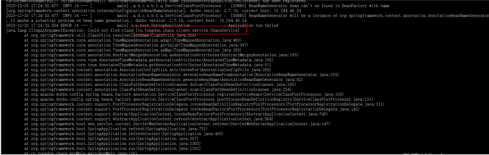
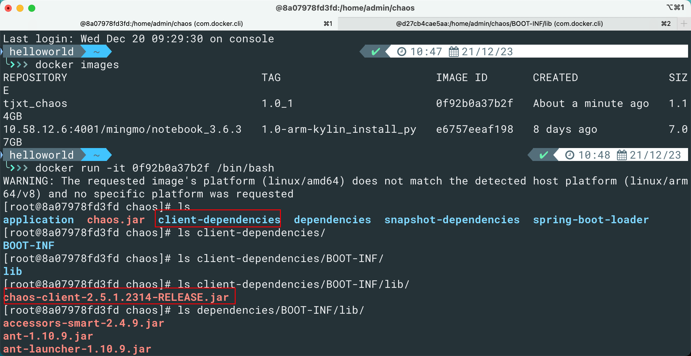
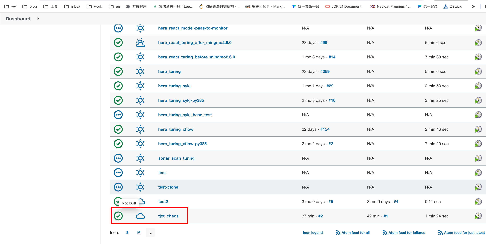
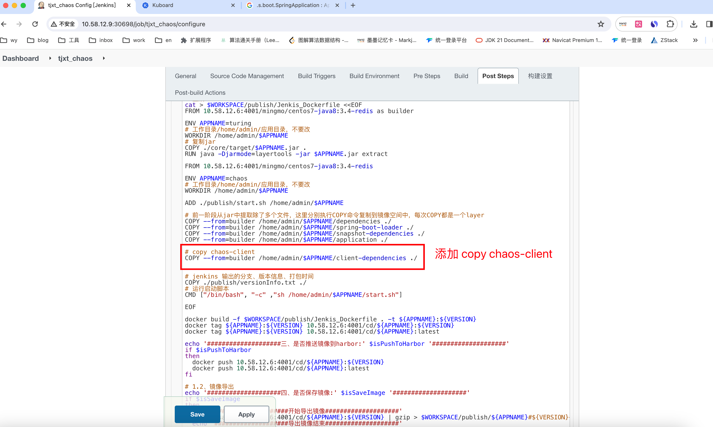

## 问题描述

chaos容器启动时报错：

 Application run failed java.lang.IllegalArgumentException: Could not find class [cn.tongdun.chaos.client.service.ChaosService]




## 问题复现

在Jenkins使用 hera_chaos_new 构建 feature-2-5-1-2314-tianjinxt，k8中启动容器会报同样的问题

## 问题排查

1. 检查 Jenkins打出的jar包，chaos.jar中存在 chaos_client，cn.tongdun.chaos.client.service.ChaosService 也存在

2. 检查镜像，从Jenkins 中拷贝出dockerfile

	```dockerfile
	FROM 10.58.12.6:4001/mingmo/centos7-java8:3.4-redis as builder
	ENV APPNAME=turing
	
	WORKDIR /home/admin/chaos
	COPY ./chaos.jar .
	RUN java -Djarmode=layertools -jar chaos.jar extract
	
	
	FROM 10.58.12.6:4001/mingmo/centos7-java8:3.4-redis
	ENV APPNAME=chaos
	WORKDIR /home/admin/chaos
	#ADD ./publish/start.sh /home/admin/chaos
	COPY --from=builder /home/admin/chaos/dependencies ./
	COPY --from=builder /home/admin/chaos/spring-boot-loader ./
	COPY --from=builder /home/admin/chaos/snapshot-dependencies ./
	COPY --from=builder /home/admin/chaos/application ./
	```

3. 先构建出第一阶段镜像

	```dockerfile
	FROM 10.58.12.6:4001/mingmo/centos7-java8:3.4-redis as builder
	ENV APPNAME=turing
	
	WORKDIR /home/admin/chaos
	#COPY ./core/target/chaos.jar .
	COPY ./chaos.jar .
	RUN java -Djarmode=layertools -jar chaos.jar extract
	```

	进入容器：

	

**chaos-client** 的jar包在 client-dependencies下

## 问题修复

在Jenkins中从 hera_chaos_new 拷贝出 tjxt_chaos，修改配置中的Dockerfile





完整的配置文件

```shell
#!/bin/bash -e
echo '开始执行打包'

# 0、参数输出
echo '####################一、参数输出####################'
echo 'JOB_NAME' $JOB_NAME
echo 'JOB_NAME' ${JOB_NAME}
echo 'JOB_BASE_NAME' $JOB_BASE_NAME
echo 'JOB_BASE_NAME' ${JOB_BASE_NAME}
echo 'JENKINS_HOME' $JENKINS_HOME
echo 'JENKINS_HOME' ${JENKINS_HOME}
echo 'WORKSPACE' $WORKSPACE
echo 'WORKSPACE' ${WORKSPACE}

time=$(date)
echo $time


# 1、获取版本与分支
chooseGitBranch=$chooseBranch
subGibBranch=${chooseGitBranch##*/}
APPNAME=chaos
imageTag=$imageTag
if [ -z $imageTag ];then
  imageTag=$subGibBranch
fi
VERSION=${imageTag}-${GIT_COMMIT:0:11}

# 输出版本信息到文件中
echo '####################二、镜像编译，应用名称为：' ${APPNAME} ' 构建分支为：' ${VERSION} '####################'

# 1.1、镜像编译、推送
echo '应用名称：' ${APPNAME} ' 构建分支：' ${VERSION} '构建时间：' $time > $WORKSPACE/publish/versionInfo.txt

# 生成 Dockerfile
cat > $WORKSPACE/publish/Jenkis_Dockerfile <<EOF
FROM 10.58.12.6:4001/mingmo/centos7-java8:3.4-redis as builder

ENV APPNAME=turing
# 工作目录/home/admin/应用目录，不要改
WORKDIR /home/admin/$APPNAME
# 复制jar
COPY ./core/target/$APPNAME.jar .
RUN java -Djarmode=layertools -jar $APPNAME.jar extract

FROM 10.58.12.6:4001/mingmo/centos7-java8:3.4-redis

ENV APPNAME=chaos
# 工作目录/home/admin/应用目录，不要改
WORKDIR /home/admin/$APPNAME

ADD ./publish/start.sh /home/admin/$APPNAME

# 前一阶段从jar中提取除了多个文件，这里分别执行COPY命令复制到镜像空间中，每次COPY都是一个layer
COPY --from=builder /home/admin/$APPNAME/dependencies ./
COPY --from=builder /home/admin/$APPNAME/spring-boot-loader ./
COPY --from=builder /home/admin/$APPNAME/snapshot-dependencies ./
COPY --from=builder /home/admin/$APPNAME/application ./

# copy chaos-client
COPY --from=builder /home/admin/$APPNAME/client-dependencies ./


# jenkins 输出的分支、版本信息、打包时间
COPY ./publish/versionInfo.txt ./
# 运行启动脚本
CMD ["/bin/bash", "-c" ,"sh /home/admin/$APPNAME/start.sh"]

EOF

docker build -f $WORKSPACE/publish/Jenkis_Dockerfile . -t ${APPNAME}:${VERSION}
docker tag ${APPNAME}:${VERSION} 10.58.12.6:4001/cd/${APPNAME}:${VERSION}
docker tag ${APPNAME}:${VERSION} 10.58.12.6:4001/cd/${APPNAME}:latest

echo '####################三、是否推送镜像到harbor:' $isPushToHarbor '####################'
if $isPushToHarbor
then
  docker push 10.58.12.6:4001/cd/${APPNAME}:${VERSION}
  docker push 10.58.12.6:4001/cd/${APPNAME}:latest
fi

# 1.2、镜像导出
echo '####################四、是否保存镜像:' $isSaveImage '####################'
if $isSaveImage
then
  echo '####################开始导出镜像####################'
  docker save 10.58.12.6:4001/cd/${APPNAME}:${VERSION} | gzip > $WORKSPACE/publish/${APPNAME}#${VERSION}-img.tar.gz
  echo '####################导出镜像结束####################'
fi


cat > start-vm.sh <<\EOF

#!/bin/bash

cd `dirname $0`
APP_HOME=`pwd`
APP_NAME="$APP_HOME"/chaos.jar
PORT=8070
DEBUG_PORT=5005
ENV=production

echo 当前应用$APP_NAME 当前目录$APP_HOME 当前环境$ENV 当前端口$PORT 当前debug端口$DEBUG_PORT
# 发布目录下是否有文件
cd $APP_HOME;
if [ ! -f ${APP_NAME} ]; then
        echo "发布目录没有需要发布的jar包";
        exit
fi

# 启动
#nohup java -jar -Xmx512m -Xms128m $WAR_FILENAME &`
echo start $APP_NAME
JVM_EXT_PARAM="-server -XX:MaxMetaspaceSize=256m -Xss256k -XX:+UseG1GC -XX:MaxGCPauseMillis=200 -XX:G1ReservePercent=10 -XX:InitiatingHeapOccupancyPercent=30 "
JVM_EXT_PARAM="-XX:+PrintGCDateStamps -XX:+PrintGCDetails -Dfile.encoding=UTF-8 -XX:+HeapDumpOnOutOfMemoryError -XX:+UseGCLogFileRotation -XX:NumberOfGCLogFiles=10 -XX:GCLogFileSize=10M  -XX:+PrintGCApplicationStoppedTime -XX:+PrintJNIGCStalls $JVM_EXT_PARAM"
JVM_EXT_PARAM="-Xloggc:$APP_HOME/logs/gc.log -XX:HeapDumpPath=$APP_HOME/logs $JVM_EXT_PARAM"
JVM_EXT_PARAM="-Xms2g -Xmx2g -XX:ConcGCThreads=2 -XX:ParallelGCThreads=2 $JVM_EXT_PARAM"
#if [[ -n $DEBUG_PORT ]]; then
#	JVM_EXT_PARAM="-agentlib:jdwp=transport=dt_socket,server=y,suspend=n,address=$DEBUG_PORT $JVM_EXT_PARAM"
#fi
CMD="java $JVM_EXT_PARAM -Dspring.profiles.active=$ENV -Dserver.port=$PORT -jar $APP_NAME"

echo $CMD
$CMD

EOF

cp start-vm.sh ./core/target/start.sh
tar zcvf $WORKSPACE/publish/${APPNAME}_${VERSION}.tar.gz -C ./core/target $APPNAME.jar start.sh


exit 0
echo '执行打包结束'
```

