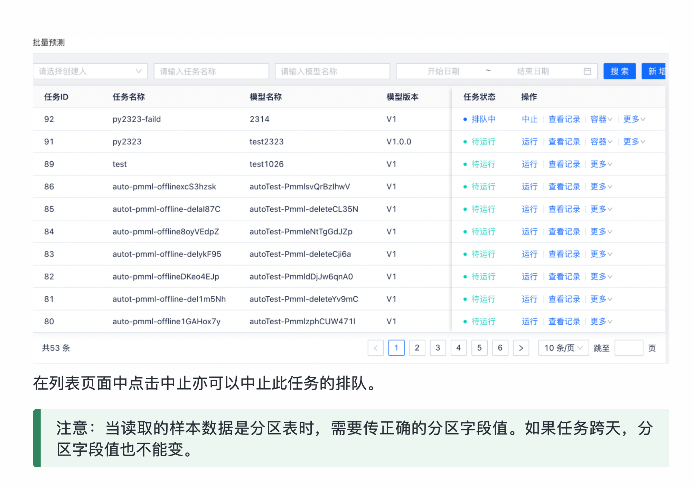
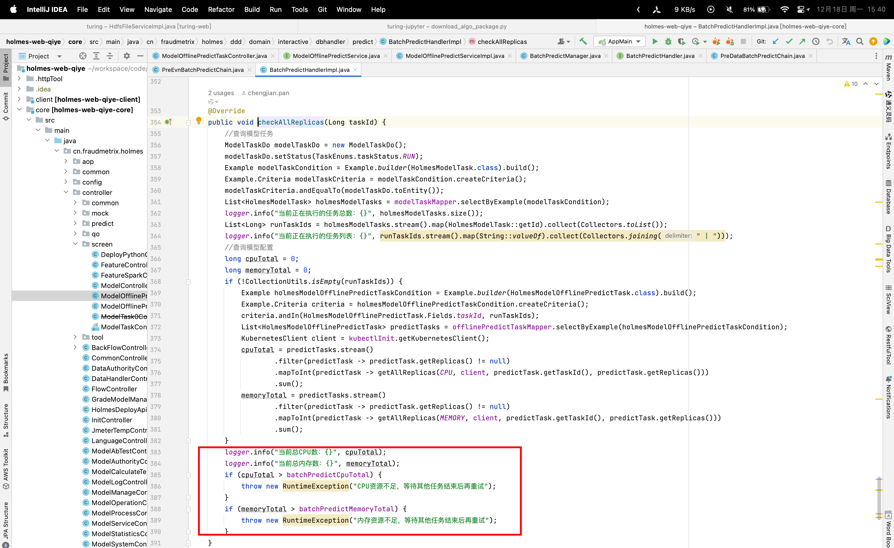
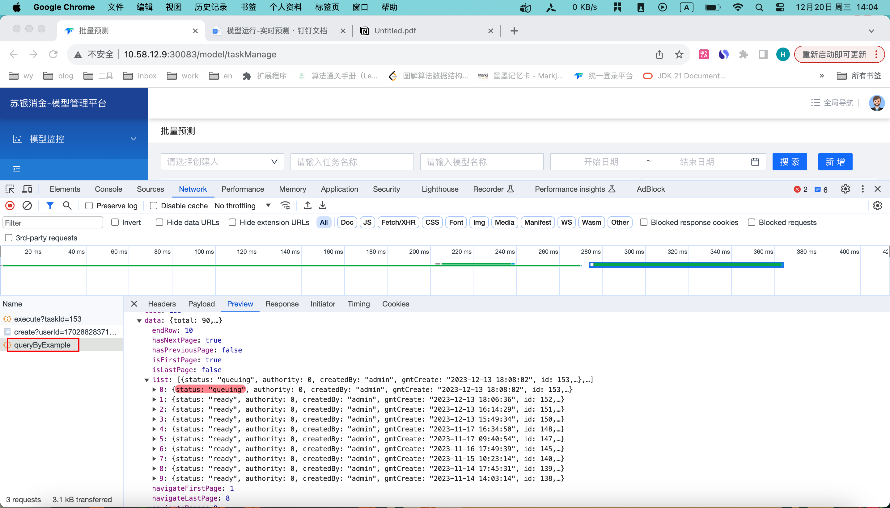
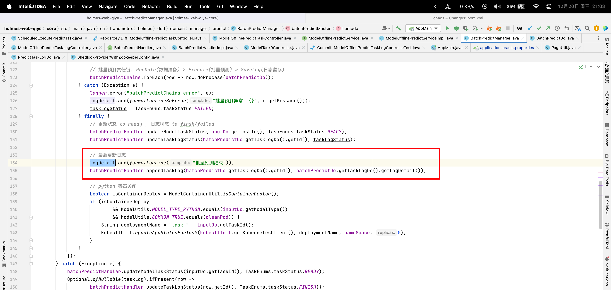

## 代码分支

- holmes-web-qiye: feature-2-5-0-2307-xc-oracle

## 需求描述




## 需求分析

之前没有可用的资源时，会直接提示运行失败。

需要修改为当资源不足时，将任务设置为排队中

### 修改前

ModelOfflinePredictTaskController.execute -> ModelOfflinePredictService.execute -> batchPredictManager.batchPredictMaster

-> batchPredictHandler.checkAllReplicas



### 修改后

1. 页面点击任务运行后，修改  HOLMES_MODEL_TASK.status 为 排队中

2. 定时任务每 1min 从 HOLMES_MODEL_TASK 中取出 status为排队中的前 n个任务，逐个执行。

	当某个任务配置的资源 >> 系统全部资源时 提示资源设置不合理，该任务不入队

## 修改点

1. 加入配置：enable_batchPredict_into_queue = true, 在controller中引入新分支，如果配置为true：则走新的处理分支
2. 新的处理分支【只针对python模型】
	* 先校验当前配置的资源是否大于系统的全部资源，如果大于：提示资源配置不合理
	* 否则 入队 修改 HOLMES_MODEL_TASK.status 为 排队中
3. 增加定时任务：每1min 从 HOLMES_MODEL_TASK 抓取 status为排队中的预测任务 (只取前3条)
  * 有可用资源：执行任务
  * 没可用资源：继续排队
4. 修改 /task/interrupt接口中的 校验：当任务处于排队中状态时，也可以被中止

### 受影响接口

/task/queryByExample 查询接口，处于排队中的任务状态为：queuing



## todo

* HOLMES_MODEL_TASK 更新状态时，modify_by时间是否会发生变化 【done】

* 140 npe 【done】

* 前端 task/queryByExample 接口返回值变化【done】

* 日志追加

	

* 手动中止排队记录日志

* 排队跨天，时间选取

	**predictTask**

	```json
	{
	    "modelUuid":"2023071465794478",
	    "modelVersion":"V1",
	    "inputFilePath":"",
	    "inputFileName":"",
	    "outputType":"hive",
	    "fileSourceType":"hive",
	    "predictTaskConfig":{
	        "dataSourceCode":"holmes",
	        "inputTable":"a1111_transfer",
	        "outputTable":"wy",
	        "inputTableDs":"ds=${yyyyMMdd-1}",
	        "outputTablePartitionType":"no",
	        "writeModel":"into",
	        "outputTableDsType":"month",
	        "retainFields":[
	
	        ],
	        "featuresSource":"HIVE_TABLE",
	        "featuresConfig":{
	            "featuresSource":"HIVE_TABLE"
	        },
	        "outputMapping":[
	
	        ],
	        "outputType":"hive"
	    },
	    "inputData":[
	        {
	            "name":"x1",
	            "dName":"x1",
	            "featureLongName":"task_id"
	        },
	        {
	            "name":"x2",
	            "dName":"x2",
	            "featureLongName":"schedule_id"
	        },
	        {
	            "name":"x3",
	            "dName":"x3",
	            "featureLongName":"EAZZ43000011"
	        },
	        {
	            "name":"x4",
	            "dName":"x4",
	            "featureLongName":"model_uuid"
	        },
	        {
	            "name":"x5",
	            "dName":"x5",
	            "featureLongName":"model_version"
	        },
	        {
	            "name":"x6",
	            "dName":"x6",
	            "featureLongName":"model_name"
	        },
	        {
	            "name":"x7",
	            "dName":"x7",
	            "featureLongName":"schedule_time"
	        }
	    ]
	}
	```

	

* 周期任务加入队列

当资源量过大时，自适应降低到系统域值

