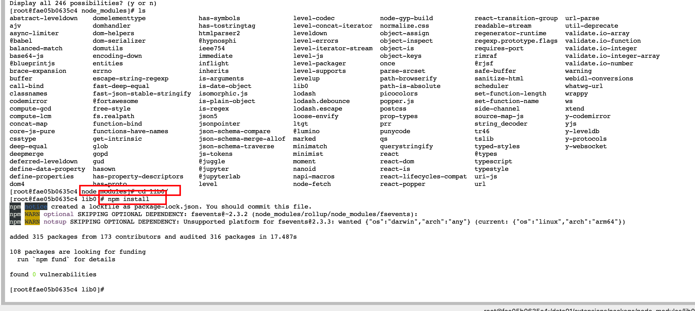
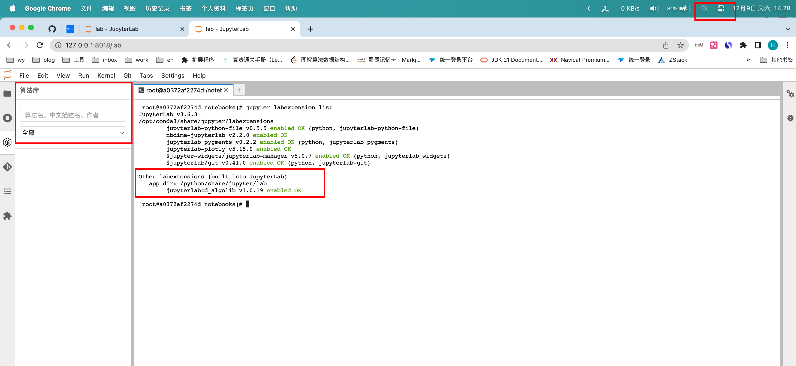
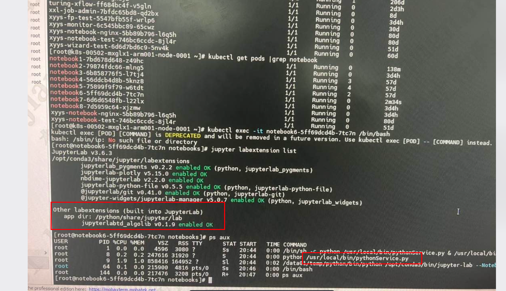

## 通过npm install 指定依赖包安装位置的方式(不可行)

1. 解压 算法库插件包

2. 在安装包内执行 npm install，成功下载了 node-moudles

3. 在安装包内执行 jupyter labextension install ./

4. 依次提示缺少，y-protocols，lib0 依赖

5. 进入算法库插件包的中的node-moudles中发现存在相关依赖包

	

进入目录：node_moudles/y-protocols, 执行npm install

进入目录，node_moudles/lib0, 继续执行 npm install

再次尝试  jupyter labextension install

又提示缺少依赖，而且缺少的还是 y-protocols

**方案不可行**。。。

## 通过docker diff 比较差异 离线安装

1. 起一个没有安装插件的容器

2. 手动安装插件

3. docker diff 获取到插件安装前后容器中的差异

	```bash
	docker diff <containerID> > ./diff.txt
	```

	发现存在差异的目录：/python/share/jupyte/lab

	​									/usr/local/share/.cache/yarn/v6

4. 再起一个没有安装插件的容器，先拷贝 /python/share/jupyte/lab，手动安装插件

	提示缺少依赖

5. 拷贝  /usr/local/share/.cache/yarn/v6 在容器中离线手动安装插件成功

6. 制作dockerfile

	```dockerfile
	## 安装插件
	## copy离线安装时需要的全部依赖包 /usr/local/share/.cache/yarn
	COPY v6 /data01/v6
	RUN mkdir -p /usr/local/share/.cache/yarn/v6
	RUN chmod -R +w /usr/local/share/.cache/yarn/v6
	RUN cp -r /data01/v6/* /usr/local/share/.cache/yarn/v6/
	
	ADD extensions /data01/extensions
	ADD install_extensions.sh /data01
	RUN chmod +x /data01/install_extensions.sh && \
	    /data01/install_extensions.sh
	```

本地环境成功离线制作镜像，启动容器后，算法库插件安装成功



**同样的方式，在客户环境制作镜像后**


**可以正常安装算法库插件**

## 解决python脚本启动问题

容器启动时，python脚本没有运行

 

检查发现，flask版本依赖包版本太低。

解决方案：从上次交付的镜像中copy出完整的依赖包




**python服务正常启动** 
