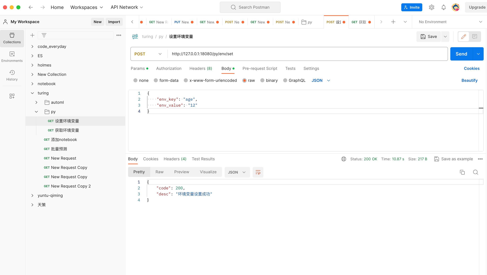

## 1. 实现根据传入的端口号，kill相应进程

```python
@app.route('/kill/<int:port>')
def kill(port):
    for i in range(0, 10):
        if terminate_process_by_port(port):
            return 'kill process success'
        time.sleep(1)
    return 'kill process error'


def find_process_by_port(port):
    for process in psutil.process_iter(['pid', 'name', 'cmdline']):
        try:
            # 获取进程监听的所有网络连接
            connections = process.connections()
            for conn in connections:
                if conn.laddr.port == port:
                    return process
        except (psutil.NoSuchProcess, psutil.AccessDenied, psutil.ZombieProcess):
            pass
    return None


def terminate_process_by_port(port):
    process = find_process_by_port(port)
    if process:
        try:
            process.terminate()
            print(f"Process with PID {process.pid} terminated.")
            return True
        except psutil.NoSuchProcess:
            print("Error: No such process.")
    else:
        print(f"No process found listening on port {port}.")
    return False
```

## 2. 调用turing接口，返回算法库信息

### envQuery

```python
@app.route('/py/algo/envQuery', methods=['GET'])
def get_env_type():
    response = requests.get(turingUrl + '/algo/envQuery')
    # 处理响应
    if response.status_code == 200:
        print('Request successful!')
        response_data = response.json()
        response_data['result'] = response_data.pop('data')
        response_data['success'] = True
        # 返回 JSON 响应
        return json.dumps(response_data, ensure_ascii=False)
    else:
        print(f'Request failed with status code {response.status_code}')
        # 如果请求失败，你可能希望抛出异常或返回适当的错误信息
        result = {"status": 1, "success": False, "message": "网络问题"}
        return json.dumps(result, ensure_ascii=False)
```

### listQuery

```python
@app.route('/py/algo/listQuery', methods=['POST'])
def get_algo_list():
    # 获取 POST 请求的原始数据
    json_data = request.json
    url = turingUrl + '/algo/listQuery'
    return post_request(url, json_data)


def post_request(url, json_data):
    headers = {'Content-Type': 'application/json'}

    # 将 Python 字典转换为 JSON 格式的字符串
    json_data_str = json.dumps(json_data)

    # 发送 POST 请求
    response = requests.post(url, headers=headers, data=json_data_str)

    # 处理响应
    if response.status_code == 200:
        print('Request successful!')
        response_data = response.json()
        response_data['success'] = True
        response_data['result'] = response_data.pop('data')
        # 返回 JSON 响应
        return response_data
    else:
        print(f'Request failed with status code {response.status_code}')
        # 如果请求失败，你可能希望抛出异常或返回适当的错误信息
        result = {"status": 1, "success": False, "message": "网络问题"}
        return json.dumps(result)
```

### 从配置文件中读取 turing ip+端口

```python
file_path = '/etc/conf/jupyter/jupyter_config.conf'
def read_config(file_path):
    config = configparser.ConfigParser()
    config.read(file_path)

    # 获取 enki_url 配置项的值
    enki_url = config.get('User', 'enki_url', fallback=None)

    if enki_url is not None:
        print(f'enki_url: {enki_url}')
    else:
        print('enki_url configuration not found.')


def get_turing_url(config_file):
    try:
        with open(config_file, 'r') as file:
            for line in file:
                # 查找包含 'enki_url' 的行
                if 'enki_url' in line:
                    _, value = line.split('=')
                    return value.strip()
        print('enki_url configuration not found.')
        return None
    except Exception as e:
        print(f'Error reading the configuration file: {e}')
        return None
```

## 3. 根据入参写环境变量

### 接口

**请求类型**：POST

**port** : 18080

**path**：/py/env/set

### 入参

**格式：** JSON

| 参数名称 | 参数类型 | 参数说明               | 是否为空 |
| -------- | -------- | ---------------------- | -------- |
| key      | str      | 要设置的环境变量的 key | 非空     |
| value    | str      | 要设置的环境变量的值   | 非空     |

### 出参

**格式**：JSON

| 参数名称 | 参数类型 | 参数说明                               | 是否为空 |
| -------- | -------- | -------------------------------------- | -------- |
| code     | str      | 200表示设置成功，其他均为失败          | 非空     |
| desc     | str      | 具体说明，如果设置失败，对应失败的原因 | 非空     |

### 调用示例

```json
{
    "env_key": "age",
    "env_value": "12"
}
```



```python
env_file_path = '/Users/helloworld/workspace/code/mingmo/turing-jupyter/arm/kylin/4-jupyter/resource/conf/json.conf'

@app.route('/py/env/set', methods=['POST'])
def set_env():
    try:
        request_data = json.loads(request.get_data())
        env_key: str = request_data['env_key']
        env_value: str = request_data['env_value']
        env_data = {env_key: env_value}

        # 将环境变量写入文件
        # 如果路径不存在，先创建路径
        env_file_dir = os.path.dirname(env_file_path)
        if not os.path.exists(env_file_dir):
            os.makedirs(env_file_dir)
        with open(env_file_path, "w") as f:
            json.dump(env_data, f)
    except KeyError as e:
        result = {"code": 500,  "desc": f"环境变量设置失败: {str(e)}"}
        return json.dumps(result, ensure_ascii=False)

    return {"code": 200, "desc": "环境变量设置成功"}
```


