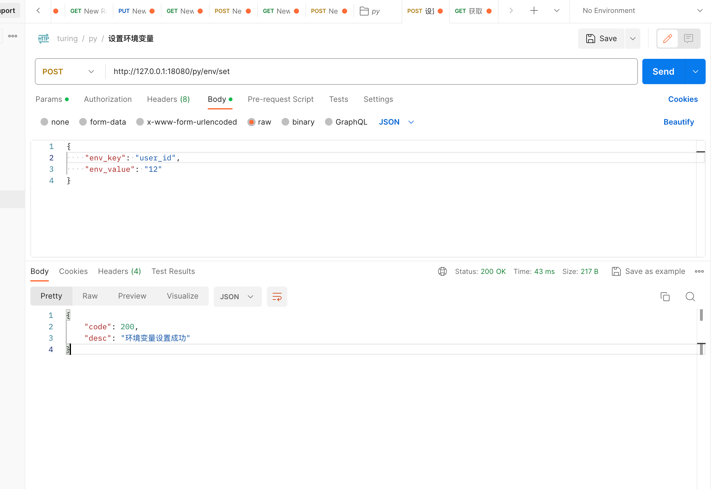

## 方案实现

启动notebook时，调用python服务，将当前用户id，写入环境变量。

download_algo_package.py 中 从环境变量获取 user_id，调用 turing服务

## 在python服务中添加 写环境变量方法

### 接口

**请求类型**：POST

**port** : 18080

**path**：/py/env/set

### 入参

**格式：** JSON

| 参数名称 | 参数类型 | 参数说明               | 是否为空 |
| -------- | -------- | ---------------------- | -------- |
| key      | str      | 要设置的环境变量的 key | 非空     |
| value    | str      | 要设置的环境变量的值   | 非空     |

### 出参

**格式**：JSON

| 参数名称 | 参数类型 | 参数说明                               | 是否为空 |
| -------- | -------- | -------------------------------------- | -------- |
| code     | str      | 200表示设置成功，其他均为失败          | 非空     |
| desc     | str      | 具体说明，如果设置失败，对应失败的原因 | 非空     |

### 调用示例

```json
{
    "env_key": "user_id",
    "env_value": "1"
}
```



```python
env_file_path = '/Users/helloworld/workspace/code/mingmo/turing-jupyter/arm/kylin/4-jupyter/resource/conf/json.conf'

@app.route('/py/env/set', methods=['POST'])
def set_env():
    try:
        request_data = json.loads(request.get_data())
        env_key: str = request_data['env_key']
        env_value: str = request_data['env_value']
        env_data = {env_key: env_value}

        # 将环境变量写入文件
        # 如果路径不存在，先创建路径
        env_file_dir = os.path.dirname(env_file_path)
        if not os.path.exists(env_file_dir):
            os.makedirs(env_file_dir)
        with open(env_file_path, "w") as f:
            json.dump(env_data, f)
    except KeyError as e:
        result = {"code": 500,  "desc": f"环境变量设置失败: {str(e)}"}
        return json.dumps(result, ensure_ascii=False)

    return {"code": 200, "desc": "环境变量设置成功"}
```


## download_algo_package.py 从环境变量中获取user_id

```python
import json
env_file_path = '/Users/helloworld/workspace/code/mingmo/turing-jupyter/arm/kylin/4-jupyter/resource/conf/json.conf'

with open(env_file_path, "r") as config_file:
    config_data = json.load(config_file)
    # 获取环境变量
env_key = "user_id"
env_value = config_data.get(env_key)
```


### 完整的 download_algo_package.py

```python
import requests
import sys
from td.config import conf
import json

env_file_path = '/Users/helloworld/workspace/code/mingmo/turing-jupyter/arm/kylin/4-jupyter/resource/conf/json.conf'

chaos_download_api = conf.chaos_download_algo_api

def download_and_save_zip(hdfs_file_path, local_path):
    try:
        with open(env_file_path, "r") as config_file:
            config_data = json.load(config_file)
        # 获取环境变量
        env_key = "user_id"
        user_id = config_data.get(env_key)

        # 发起请求获取数据
        params = {}
        params['userId'] = user_id
        params['filePath'] = hdfs_file_path
        response = requests.get(chaos_download_api, params=params)
        # 检查请求是否成功
        response.raise_for_status()

        # 将文件流写入本地zip文件
        with open(local_path, 'wb') as f:
            f.write(response.content)
        # 将路径添加到系统路径中
        sys.path.append(local_path)
        print(f"Zip file downloaded and extracted to {local_path}")

    except requests.exceptions.RequestException as e:
        print(f"Error downloading or extracting the zip file: {e}")
```

