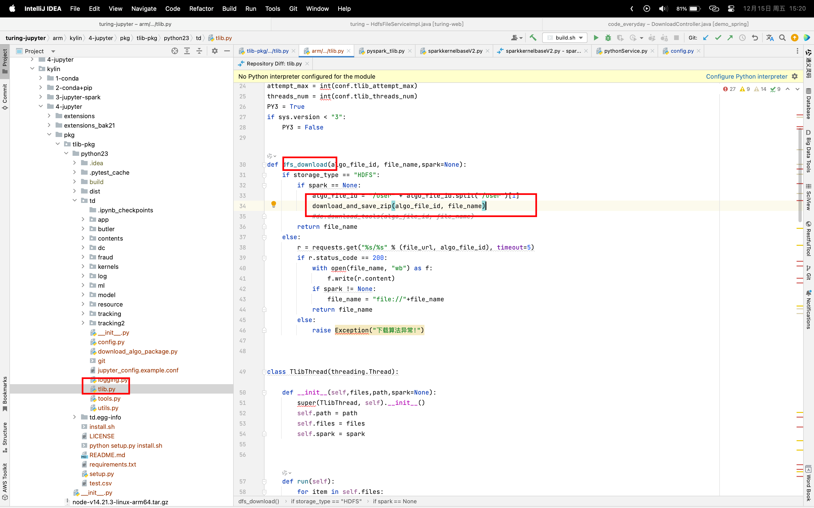
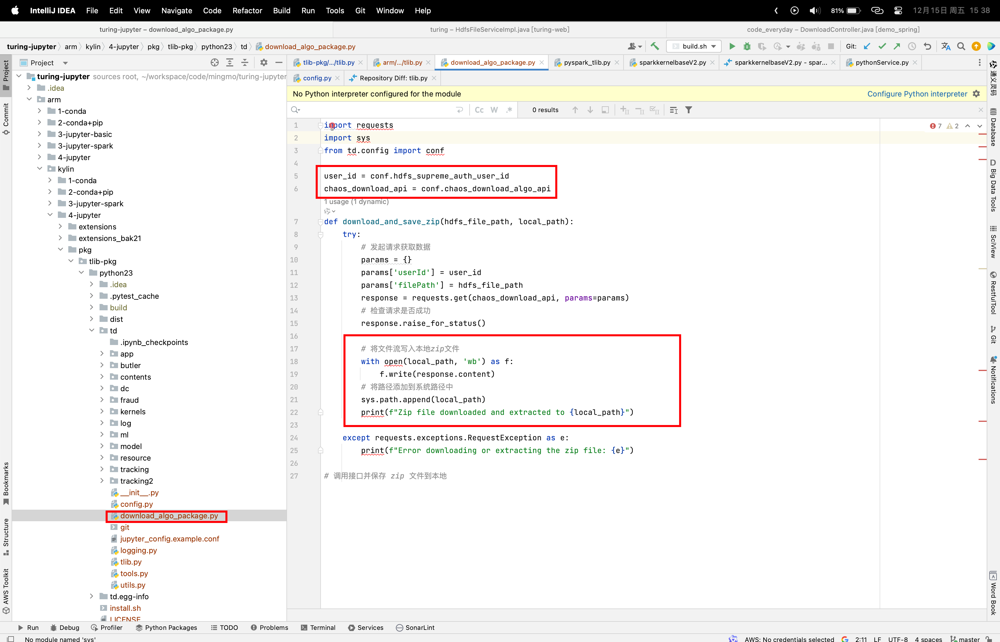

## 算法包加载

notebook容器中的服务调用chaos接口，获取算法包，加载到 /tmp/{pid}/{alg0.zip}

### 需要添加的配置

1. 环境变量中添加 user_name = mxglpt
2. jupyer_config.conf中添加
	* hdfs_supreme_auth_user_id (hdfs用户名)
	* chaos_download_algo_api (chaos提供的从hdfs下载算法包接口)

### 核心python文件位置

**tlib-pkg/python23/td/tlib.py** 

**tlib-pkg/python23/td/download_algo_package.py**

## pyspark引入依赖解决

1. 替换sparkkernelbase.py文件

	/opt/conda3/lib/python3.7/site-packages/sparkmagic/kernels/wrapperkernel/sparkkernelbase.py

2. 替换 tlib.py 文件 （增加方法）

	/opt/conda3/lib/python3.7/site-packages/td-0.0.0-py3.7.egg/td/tlib.py 增加方法

## DockerFile修改

1. Dockerfile_kylin_algo 覆盖tlib包
1. Dockerfile_kylin_algo 覆盖sparkkernelbase.py，tlib.py