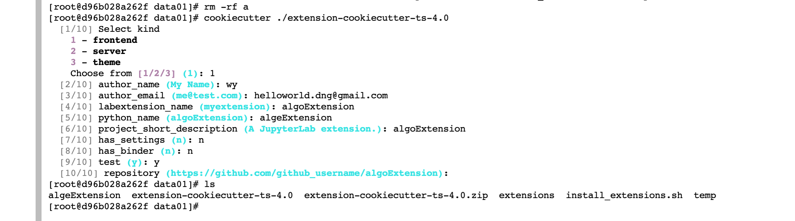

```bash
pip install cookiecutter
```

```bash
cookiecutter ./extension-cookiecutter-ts-4.0
```



```js
import {
  JupyterFrontEnd,
  JupyterFrontEndPlugin
} from '@jupyterlab/application';

import {
  ICommandPalette
} from '@jupyterlab/apputils';

import {
  ReactWidget
} from '@jupyterlab/apputils';

import { IMainMenu } from '@jupyterlab/mainmenu';

/**
 * Initialization data for the algo-extension extension.
 */
const extension: JupyterFrontEndPlugin<void> = {
  id: 'algo-extension',
  autoStart: true,
  requires: [ICommandPalette, IMainMenu],
  activate: (app: JupyterFrontEnd, palette: ICommandPalette, mainMenu: IMainMenu) => {
    console.log('JupyterLab 插件 algo-extension 已激活！');

    // 创建一个新的命令
    const commandId = 'algo-extension:open';
    app.commands.addCommand(commandId, {
      label: '打开 Algo 扩展',
      execute: () => {
        openAlgoExtension(app, mainMenu);
      }
    });

    // 添加命令到命令面板
    palette.addItem({ command: commandId, category: 'Algo 扩展' });
  }
};

function openAlgoExtension(app: JupyterFrontEnd, mainMenu: IMainMenu) {
  // 创建一个 React 组件作为按钮点击后显示的内容
  const content = new ReactWidget();
  content.addClass('algo-extension-content');
  content.node.appendChild(document.createElement('div'));
  content.node.querySelector('div').textContent = '这是 Algo 扩展的内容';

  // 将 React 组件添加到主区域
  const widget = new Widget({ node: content.node });
  widget.title.label = 'Algo 扩展';
  widget.title.closable = true;

  // 创建一个新的菜单项，将 React 组件添加到菜单中
  const menu = mainMenu.addMenu({ menu: 'Algo 扩展', rank: 80 });
  menu.addItem({ command: 'algo-extension:show-content' });

  // 在菜单项点击时显示 React 组件
  menu.itemClicked.connect(() => {
    app.shell.add(widget, 'left');
  });

  // 创建一个新的命令，用于显示菜单项的内容
  app.commands.addCommand('algo-extension:show-content', {
    label: '显示内容',
    execute: () => {
      app.shell.add(widget, 'left');
    }
  });
}

export default extension;

```

备份 index.ts

```js
import {
  JupyterFrontEnd,
  JupyterFrontEndPlugin
} from '@jupyterlab/application';

/**
 * Initialization data for the algoExtension extension.
 */
const plugin: JupyterFrontEndPlugin<void> = {
  id: 'algoExtension:plugin',
  description: 'algoExtension',
  autoStart: true,
  activate: (app: JupyterFrontEnd) => {
    console.log('JupyterLab extension algoExtension is activated!');
  }
};

export default plugin;
```

在插件的根目录下执行

```bash
jlpm install
```

报错

```bash
jlpm install
yarn install v1.21.1
info No lockfile found.
error Workspaces can only be enabled in private projects.
info Visit https://yarnpkg.com/en/docs/cli/install for documentation about this command.
```

使用npm安装依赖

```bash
npm install
```

```bash
jlpm build
```

```bash
jupyter labextension install .
```


