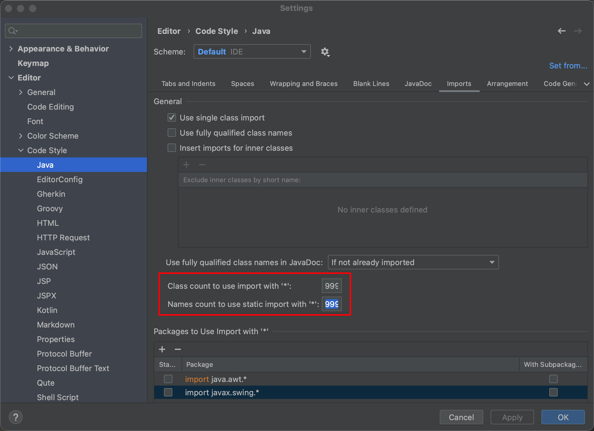

# idea 配置

## 1. 设置作者信息

```java
File ——> Settings…——> Editor ——> File and Code Templates ——> Includes ——> File Header

/**
 * @author HelloWorld
 * @create ${DATE} ${TIME}
 * @email 111111@mail.com
 */
```

## 2. 方法创建信息


**Abbreviation 处一定不能有 / 否则会导致获得的参数为空**

参数设置


param

```java
groovyScript("def result=''; def params=\"${_1}\".replaceAll('[\\\\[|\\\\]|\\\\s]', '').split(',').toList(); for(i = 0; i < params.size(); i++) {result+='* @param ' + params[i] + ((i < params.size() - 1) ? '\\n ' : '')}; return result", methodParameters())
```

return

```java
groovyScript("def returnType = \"${_1}\"; def result = '* @return ' + returnType; return result;", methodReturnType());
```

```java
**
 * @description $description$
 * @author HelloWorld 
 * @date $date$ $TIME$ 
 $param$
 $return$
 */
```

## 3. 滑动鼠标调整字体大小

```java
setting => Editor => General => Mouse => Change font Size(选中)
```

## 4. 编辑栏显示多个文件

```java
1. setting => Editor => General => Editor tabs
2. 取消选中 show tabs in single row
3. 最大限制数设为一个较大的值
```

## 5. idea 最大内存设置

```java
 help => Edit Custom VM Options

  -Xms1024m
  -Xmx2048m
  -XX:ReservedCodeCacheSize=1024m
```

## 6. idea中显示SpringBoot RunDashBoard

```java
在.idea/workspace.xml 中 定位到 <component name="RunDashboard"> 添加

<option name="configurationTypes">
	<option value="SpringBootApplicationConfigurationType" />
</option>
```

## 7. idea 插件

- MyBatisX
- RestfulTool
- TongYiLingma

## 8. 取消 import *

**settings->Editor->Code Style->Java->Imports**

* Import with * 两个配置设置成一个很大的值

